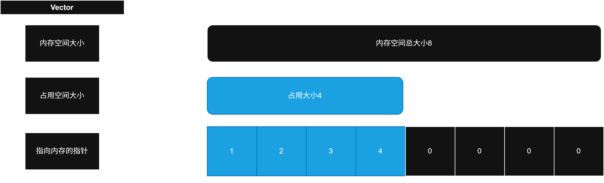

# 变长数组（Vector）
>变长数组是一种常见的计算机数据容器，用来存储数据，变长数组会在当前分配的可用空间不够时扩充当前的空间以容纳新的元素。
>
>变长数组有三个成员，一个是当前分配的空间大小，一个是当前元素占用的空间大小，一个是指向存储元素的内存的指针。
>
>在本题目中，你需要实现一个变长数组存储`int`类型的数据。变长数组的操作如下
```
原先的空间：1，2，3，4，5，6 |（6，6）->(分配的长度，占用的长度)

添加元素（1）到变长数组中
1. 检查当前分配的长度与占用的长度是否相等
2. 如果相等，分配(n+1)*2长度的新空间，并设置为0（memset）
   0，0，0，0，0，0，0，0，0，0，0，0，0，0 | (14,6)
3. 拷贝所有原先数组中的内容到新的区域（for）
   1，2，3，4，5，6，0，0，0，0，0，0，0，0 | (14,6)
4. 将1添加到新的空间的末尾(space[7-1] = 1)
   1，2，3，4，5，6，1，0，0，0，0，0，0，0 | (14,7)
   
   
将元素（1）从变长数组中删除
1. 将有效长度-1
   1，2，3，4，5，6，1，0，0，0，0，0，0，0 | (14,6)
2. 检测当前分配的长度是否小于分配的大小/2
   14/2 > 6
3. 分配新的内存，大小为当前分配内存/2，并设置为0（memset）
   0，0，0，0，0，0，0 | (7,6)
4. 拷贝所有原先数组中的内容到新的区域（for）
   1，2，3，4，5，6，0 | (7,6)
```

## 需要实现的结构
>变长数组需要包含以下内容
- 可用存储空间的大小：`int`
- 占用的空间大小：`int`
- 指向存储空间的指针：`int*`


>实现一个enum，名为Boolean，包含三个元素
>- TRUE 1
>- FALSE 0
>- ERROR -1

```C
//创建Enum
typedef enum
{
}Enum名称;
```
---
## 提供的函数
### int reallocateSize(int memorySize, int occupiedSize)
>用于计算重新分配时的内存大小
```C
//memorySize为当前的内存大小
//occupiedSize为当前实际使用的元素大小
//如果返回-1，则不需要进行重新分配
//如果返回0，则需要对已经分配的内存执行free()，并设为NULL
int reallocateSize(int memorySize, int occupiedSize)
{
	int half = memorySize/2;
	if(memorySize == occupiedSize)
		return (memorySize+1) * 2;
	else if(half > occupiedSize)
		return half;
	else
		return -1;
}
```

### void vectorPrint(Vector* vector)
> 用于打印`vector`中的内容到屏幕上，需要正确实现`VectorSize`和`VectorGet`
```C
void vectorPrint(Vector* vector)
{
	if(vector)
	{
		printf("[");
		for(int n = 0 ;n<VectorSize(vector);++n)
		{
			printf("%d,",VectorGet(vector,n));
		}
		printf("\b]");
	}
}
```
---

## 需要实现的函数
### Vector* VectorCreate()
>创建一个空的`Vector`

### Vector* VectorAllocate(int size)
>创建一个拥有`size`长度的内存空间的`Vector`，但没有任何元素

### Vector* VectorCreateBy(int array[], int size)
> 通过一个给定的数组，创建一个`Vector`

### Boolean VectorEmpty(Vector* vector)
> 判断给定的`vector`是否为空，或传入的指针本身为空，如果为空返回TRUE，不是返回FALSE

### Boolean VectorAdd(Vector* vector, int newElement)
> 添加当前的新元素到vector中，如果当前分配的内存用尽则分配新的内存（使用`reallocateSize`计算）

### Boolean VectorRemove(Vector* vector, int position)
> 将指定位置的元素删除，如果指定元素后有有效元素则将所有元素前移
```C
1,2,3,4,5 (5,5)
//删除3
1,2,4,5,5 (5,4)
```

### unsigned int VectorSize(Vector* vector)
>返回`Vector`中的占用大小（有效元素数量）

### unsigned int VectorCapacity(Vector* vector)
>返回`Vector`中的内存大小

### VectorClear(Vector* dest)
> 删除`vector`中存储的数据，但不删除`Vector`本身

### void VectorDelete(Vector* vector)
> 将当前`vector`中的的内存和`vector`本身都删除

### Boolean VectorSet(Vector* vector, int where, int newValue)
> 将指定位置的元素设置为新给定的数值，如果指定位置不存在（超出了当前的有效范围）就返回FALSE，其他情况返回TRUE

> 如果where超过了`VectorSize`的范围，但是小于`VectorCapacity`，也属于超出有效范围。
> - 因为可能存在当前分配了10长度的内存，但是只有6个数据，但是我直接访问第8个位置（也就是第九个元素）。
> - 这个时候在下标5（第六个元素）和下标8（第九个元素）之间就会产生空隙，导致数据不连续，
> - 不符合数组的定义（有限个连续的数据）

### int VectorGet(Vector* vector, int where)
> 返回指定位置的元素值

### int VectorFind(Vector* vector, int value)
> 返回指定值在当前vector中的位置，如果不存在则返回ERROR

### Boolean VectorExists(Vector* vector, int value)
> 查找指定value存不存在于当前的`vector`中，如果存在返回TURE，不存在返回FALSE，如果`vector`为NULL则返回ERROR

### void VectorExchange(Vector* vector1,Vector* vector2)
>交换两个`Vector`中的内容

### void VectorCopy(Vector* dest,Vector* source)
>将`source`中的数据拷贝到`dest`中，如果超出`dest`的长度则分配新的内存

### VectorTrim(Vector* dest, int size)
> 将`Vector`的有效长度限制到`size`，`size`**不能**大于当前的有效长度，如果满足内存重新分配条件，则重新分配内存。

### VectorResize(Vector* dest, int size)
> 将`Vector`的有效长度设置为`size`，`size`**可以**大于当前的有效长度，如果满足内存重新分配条件，则重新分配内存。
