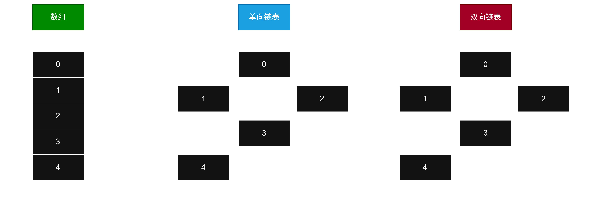
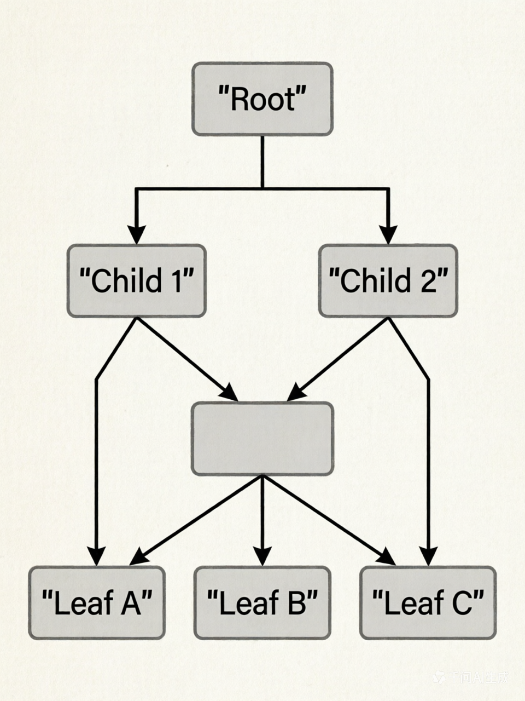
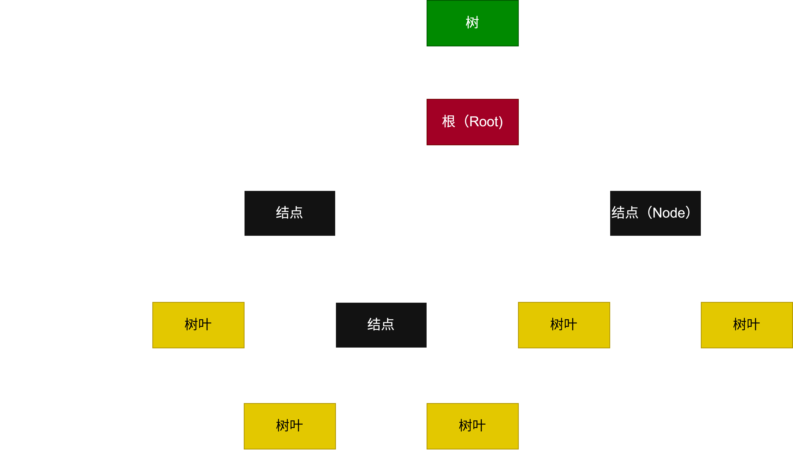

# 栈(stack)
>栈是先入后出的数据结构（FILO-First In Last Out）。拥有两个操作，入栈和出栈

```c
栈=栈顶Top(最先取出)->{}<-栈底Bottom(最后取出)

//入栈5201314
5->{5}
2->{2,5}
0->{0,2,5}
1->{1,0,2,5}
3->{3,1,0,2,5}
1->{1,3,1,0,2,5}
4->{4,1,3,1,0,2,5}

//出栈
4<-{1,3,1,0,2,5}//最后进入栈的数据先取出栈
1<-{3,1,0,2,5}
3<-{1,0,2,5}
1<-{0,2,5}
0<-{2,5}
2<-{5}
5<-{}
```

# 队列
>栈是先入先出的数据结构（FIFO-First In First Out）。拥有两个操作，入队和出队
```c
队列=队首(最先取出)->{}<-队尾(最后取出)

//入队5201314
{5}<-5
{5,2}<-2
{5,2,0}<-0
{5,2,0,1}<-1
{5,2,0,1,3}<-3
{5,2,0,1,3,1}<-1
{5,2,0,1,3,1,4}<-4
//出队
5<-{2,0,1,3,1,4}//最先进入队列的数据先取出队列
2<-{0,1,3,1,4}
0<-{1,3,1,4}
1<-{3,1,4}
3<-{1,4}
1<-{4}
4<-{}
```

# 链表
>链表可以类比于数组，和数组一样是存储数据的容器，但是其数据存储是分散在堆上的

- **数组**可以直接通过开始位置+n的方式任意访问所有元素
- **链表**只能一层一层地寻找，即`0->1->2->3`，无法直接`0->3或者0->2`
- **单向链表**只能进行一个方向的寻找`0->1->2->3`，无法从`1->0或3->2->1->0`
# 树
>树是一种更复杂的数据结构，如名称所言，树的结构像是一棵树。其存在的意义是可以提升数据的搜索效率、排序无序的数据。

## 二叉树
>树有很多种，最简单也最常用的就是二叉树，二叉树顾名思义就是每个节点有两个分叉的树

- **树高**：树有多少层节点
- **根**：树最高的节点，一个树只有一个根
- **普通结点**：一个普通的树结点，拥有两个子结点和当前结点的数据
- **兄弟**：在同一层的几个结点互为兄弟
- **子结点**：当前结点的下一级结点，对于二叉树分为**左**子结点和**右**子结点
- **树叶**：**没有任何子结点的结点**，但树叶是动态，当树叶拥有子结点时，该子结点会变为树叶，原先的树叶退化成普通结点。

# 实现
## 栈
```c
typedef struct {
    int *data;    // 数据数组
    int top;      // 栈顶在数组内的下标，-1表示空
    int capacity; // 最大容量
} Stack;

Stack* stack_create(int capacity) {
    Stack *s = malloc(sizeof(Stack));         // 在堆上分配了一个Stack对象
    s->data = malloc(capacity * sizeof(int)); // 在堆上分配了一个数组，并将data指向堆上的内存
    s->top = -1; //设置栈顶为-1
    s->capacity = capacity; //设置栈的大小为给定的capacity
    return s;
}

void stack_destroy(Stack *s) {
    free(s->data);//先释放stack中的内存
    free(s);//再释放stack自己
}
bool stack_push(Stack *s, int value) {
    if (stack_is_full(s)) return false;//如果栈的数组区域已经被填满了，就返回false
    s->data[++s->top] = value;  // top先加，再赋值
    return true;
}
int stack_pop(Stack *s, int *value) {
    if (stack_is_empty(s)) return false;//如果栈是空的，就返回false
    *value = s->data[s->top--];  // 先取值，top再减
    return true;
}
bool stack_is_empty(Stack *s) { return s->top == -1; }
bool stack_is_full(Stack *s)  { return s->top == s->capacity - 1; }
int  stack_size(Stack *s)     { return s->top + 1; }
```
