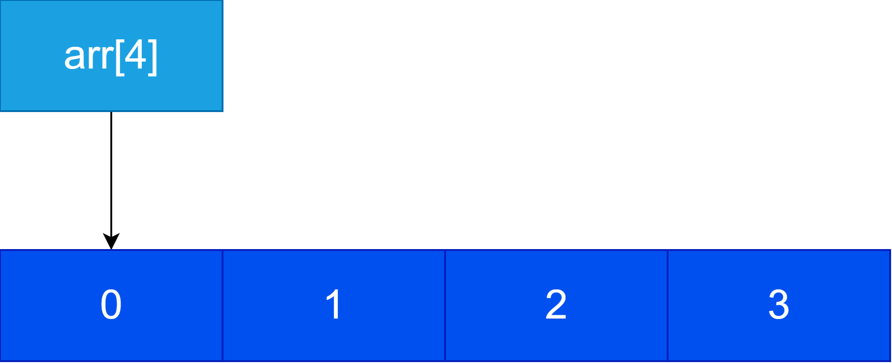
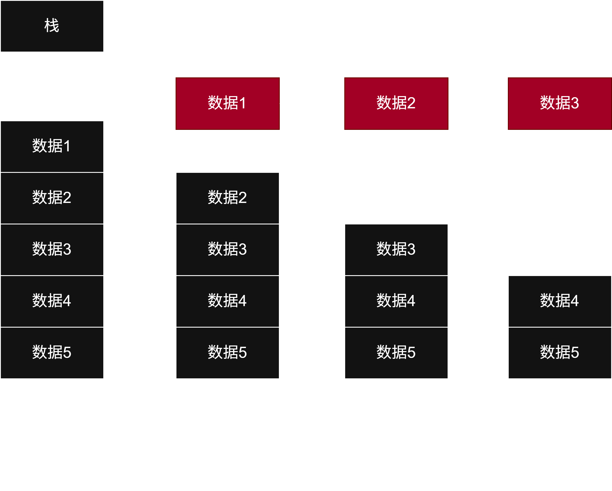
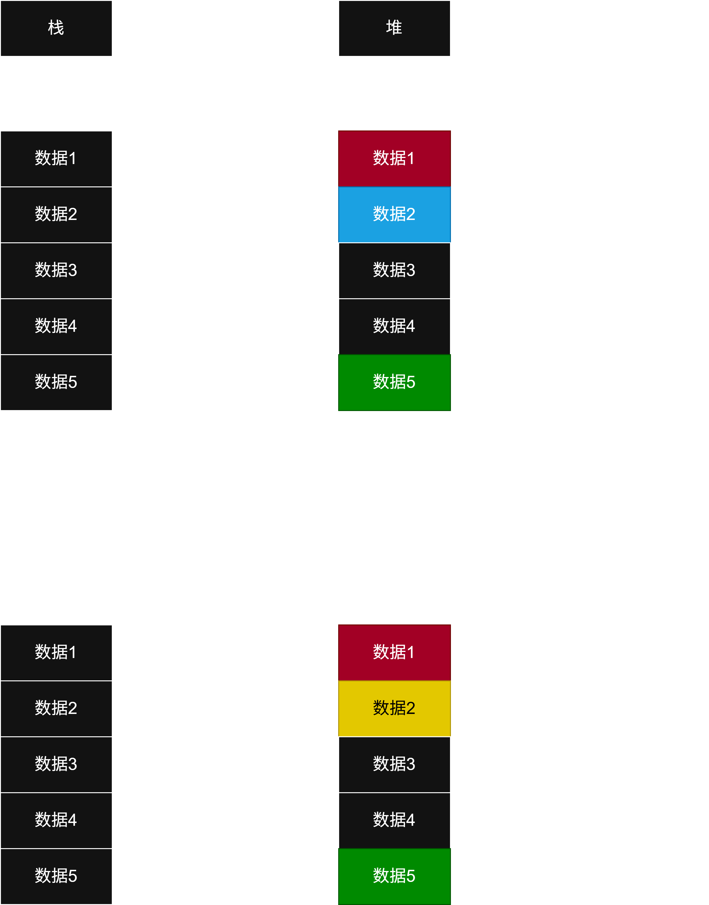
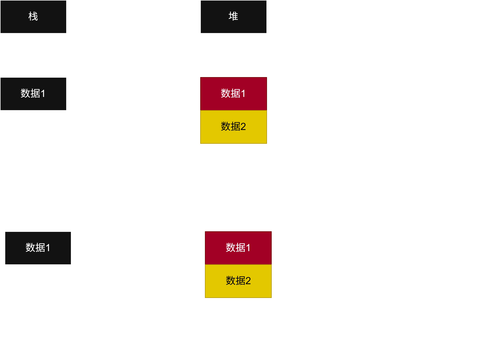

# sizeof
>**sizeof**可以用于获取指定元素的内存占用大小，如`sizeof(int)=4,sizeof(char)=1`等。如果括号内是数组，它会直接返回数组的总占用空间，即`数组长度*单个元素大小`


# C语言的指针
```c
int* ptr=&a;//&表示取a的地址
ptr=保存的是地址
*ptr=表示的是地址内的值
```

- 在C中，数组的名称实际上是指向第一个元素的指针

- 所以访问时的`arr[0],arr[1]`等实际上等价于`arr+0,arr+1`（这里的arr是第一个元素的地址）。这个`+1`并不是1字节，而是一个单元的长度，如果`arr`是一个`int`数组，那这个`+1`实际上就是`+1 * sizeof(int)`。

## 指针的大小
>指针的大小取决于你所使用的操作系统平台，如果是**64位**操作系统就是**8字节**，如果是**32位**操作系统就是**4字节**。

- 这个32位和64位操作系统实际上描述的就是**指针的长度和其能存储数据的最大能力**。（因为数据太多就会导致地址耗尽）目前市面上常用的计算机都是**64位**系统。

# C语言的函数参数传递
## 值传递
>拷贝当前变量，变为一个副本，传入函数中(传递任意类型的变量时都传递的是一个拷贝副本)

```c
void function(int a)//function::a
{
	value = 20
}
void main()//main::a
{
	int a = 10;
	function(a);
	//此时的a还是10
}
//上面的两个a只是同名同姓的两个 不同  的变量
```
## 指针传递
>传递变量的内存地址

```c
void function(Position* pos)//function::pos{201,302}
{
	pos->x = 10;
	//基于pos的地址直接修改pos地址位置所表示的值
}
void main()
{
	int a, b;
	Position pos={201,302};//main::pos
	function(&pos);
	//&pos传递pos这个变量的地址到函数中
}
```

### 函数传递值时的指针退化
>C在使用函数参数传递数组时，会将**数组退化为一个指针**。原因是，如果有一个**非常大的数组**通过函数参数传递，那每次传递时都需要进行一次复制，非常**浪费空间**。因此C语言选择**直接传递这个数组内存所在的地址**，而非拷贝一次数组。

```C
void function(int arr[])
{
	int s = sizeof(arr);
	//这里的s为 8 或 4，因为这里的arr实际上已经变成了一个指针。
	//这里的arr指向main中的arr的位置，所以对arr做的一切更改都会同步在main中的arr里
	arr[0] = 10;
}
void main()
{
	int arr[5] = {0};//arr={0,0,0,0,0}
	int s = sizeof(arr);
	//这里的s为 5 * 4 = 20
	function(arr);
	
	//因为function中修改arr[0]为10，所以在这里arr={10,0,0,0,0}
}
```

# 堆区和栈区
## 栈
> 是计算机在运行时程序自行创建的区域，常见的局部变量、局部数组等都在堆上

```c
void main()
{
	int a = 0;
	double d = 1.2;
	//这些都会在栈上
}
```


## 堆
>是计算机在运行时程序员手动分配的区域，需要被手动回收

```c
void main()
{
	int* a = (int*)malloc(sizeof(int));
	//a指向一个分配在堆上的内存
	free(a);
	//将分配给a的内存回收
	a = NULL;
	//清空a为空指针（即什么内存都不指向），因为使用被回收的内存是非常危险的操作！！！
}

```

### 分配内存
>分配内存使用`<stdlib.h>`中的`malloc`函数，会给分配一个在堆上元素
```c
void main()
{
	int* a = (int*)malloc(sizeof(int));
	//参数为需要分配的内存大小
	//需要将malloc返回的指针转换为需要的指针类型（如int*）
}
```

### 释放内存
>释放内存使用`<stdlib.h>`中的`free`函数，会将内存所有权返回，在适当时间返回给操作系统重新利用

```c
void main()
{
	int* a = (int*)malloc(sizeof(int));
	free(a);
	//释放堆内存a
	a = NULL;//0
	if(a == NULL)
	{
	}
	//将a指向NULL，即什么都不指向，以确保不会意外地访问被回收的内存。
	//malloc一定要和free配对使用，否则会导致内存泄漏
}
```

