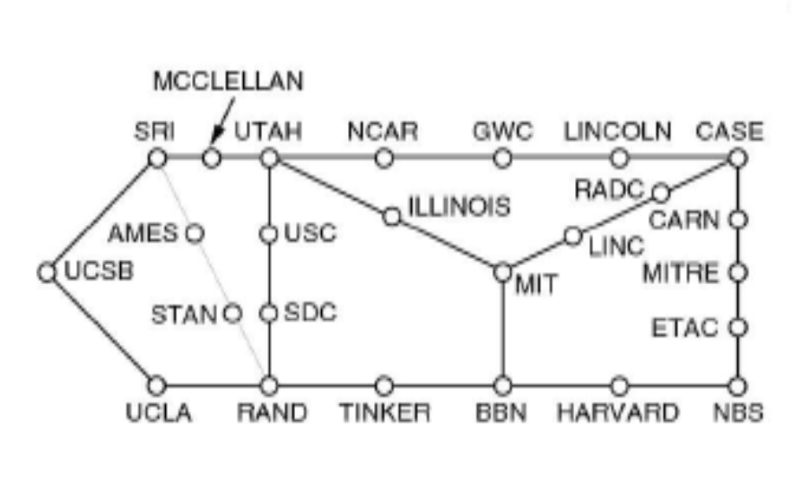
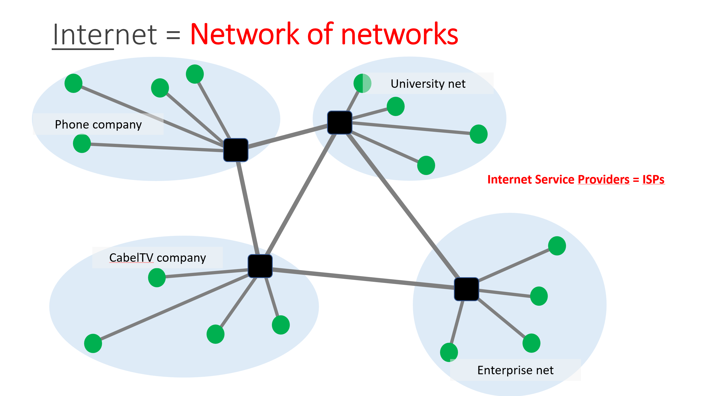
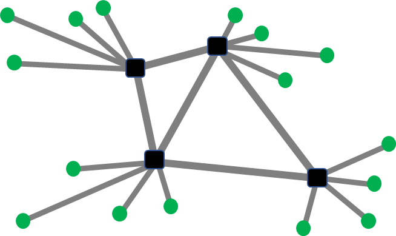
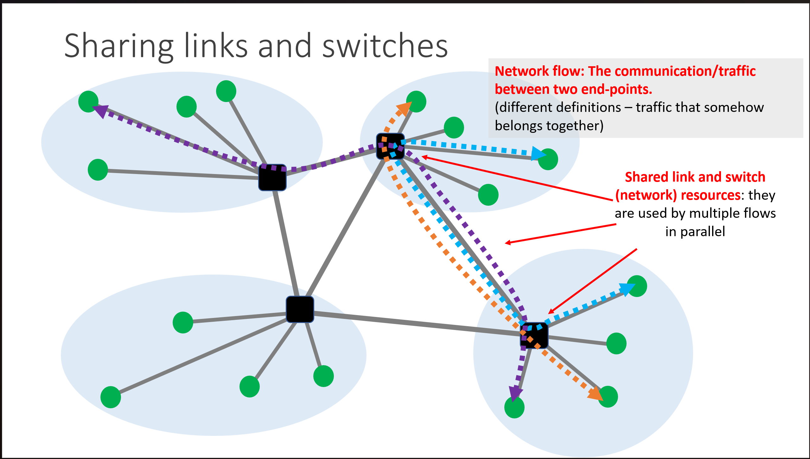
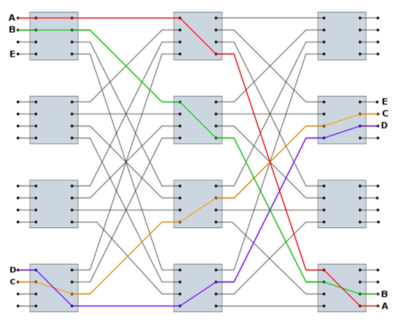
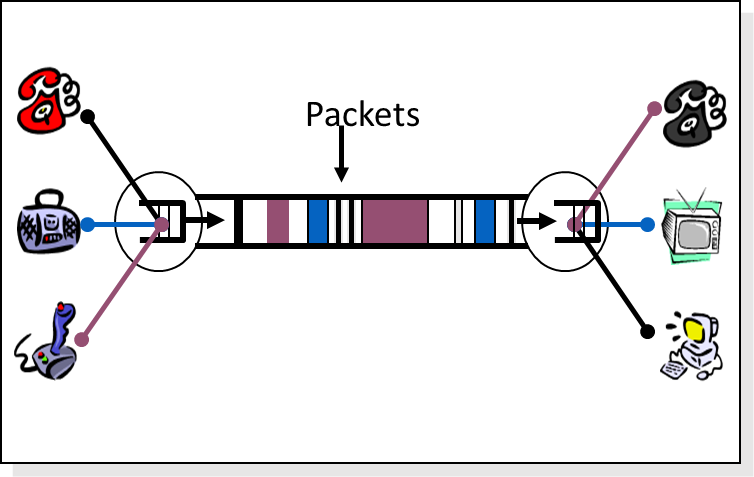
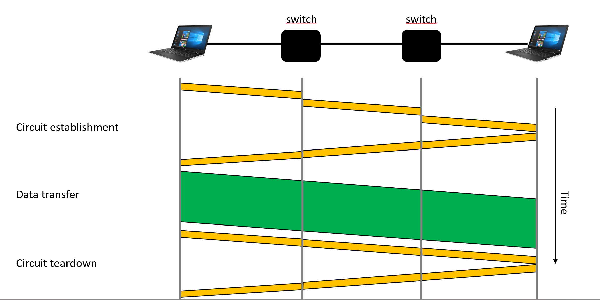
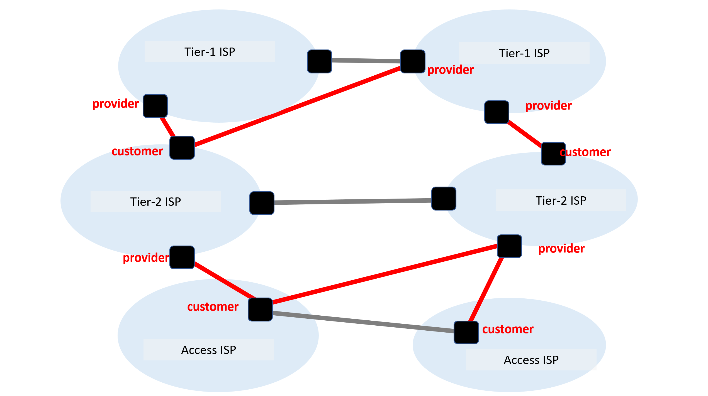
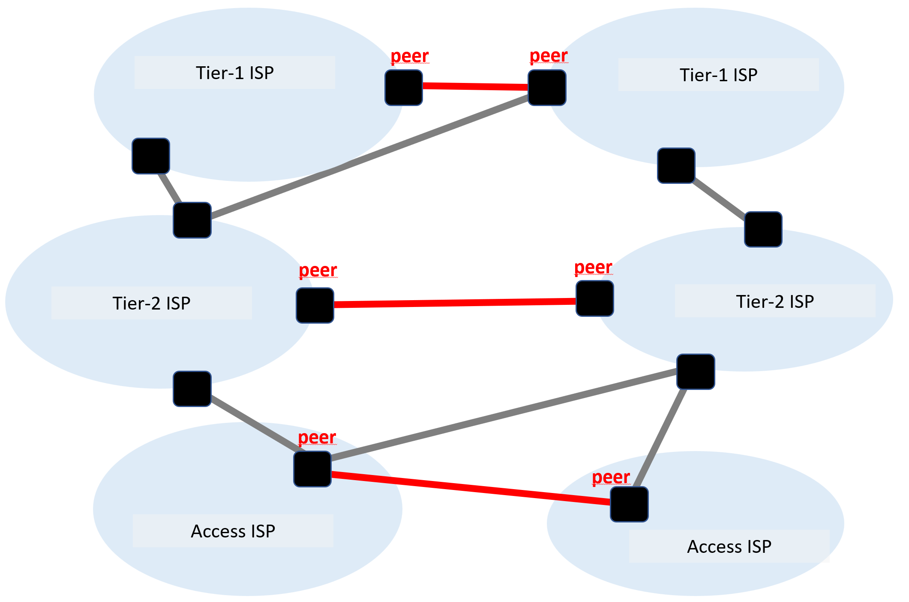
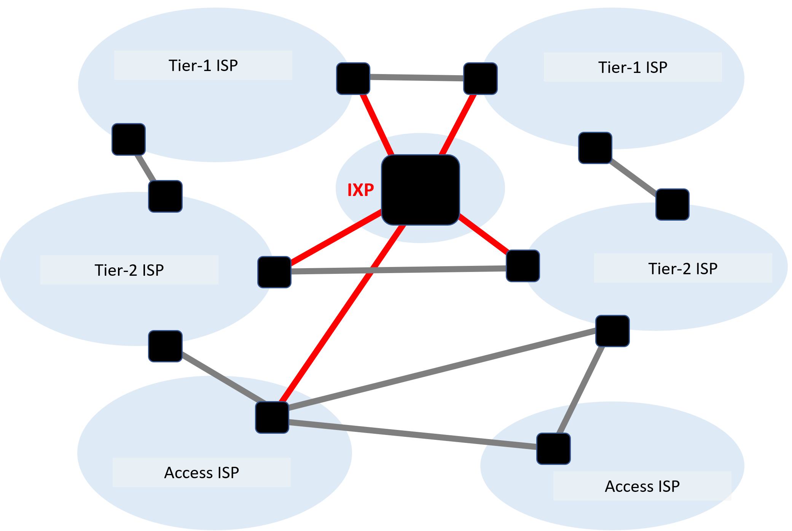

# 概览
# Number of Device online
- 30 Billion (until 2023) by Cisco Visual network index

---
# Daily total internet traffic
- 13 exabyte (until 2022)

---
# Percentage of Video traffic online
- 82%

---
# Goal
1. Addressing
2. Layering
3. Routing
4. Reliability
5. Resource Sharing

---
# History
**1950th**
- Phone networks = the communication network
**1960th**
- Advanced Research Projects Agency NETwork (ARPANET)
  
The first message over the Internet: "LO"
**1970th**
- Network Control Program (NCP)
- Email and Telnet
- Ethernet
- TCP/IP
**1980th**
- NCP to TCP/IP
- NSFNet (TCP/IP)
- First Internet crashes caused by congestion
- Van Jacobson saves the Internet
**1990th**
- WEB
- First search engine (Excite)
- NSFNet closed
- Google reinvents searching
- 

---
# What is Network
1.  **End Point**
	- Where sending and receiving data.

2. **Switch and Router**
	Where forward data to the destination.
	- _Router_
		- _Home router_
			- 带宽：1 Gbps
		- _Data center router_
			- 带宽：1.8-6.5 Tbps
		- _Internet core router_
			- 带宽：12.8-922 Tbps
	- _链路(links)_
	  连接端点与路由和交换机的路径
		- _铜缆_(ADSL, RJ45, Coax)
		- _光纤_
		- _无线_
	-  _带宽(Bandwidth)_
		The bandwidth is used to measure and quantify the available or used communication resources. (bps = bit per second)

| 比特速度           | 带宽    | 名称                  |
| -------------- | ----- | ------------------- |
| $10^3bit/s$    | 1Kbps | Kilobit per second  |
| $10^6 bit/s$   | 1Mbps | Megabit per second  |
| $10^9 bit/s$   | 1Gbps | Gigabit per second  |
| $10^{12}bit/s$ | 1Tbps | Terrabit per second |
| $10^{15}bit/s$ | 1Pbps | Petabit per second  |
| $10^{18}bit/s$ | 1Ebps | Exabit per second   |

---
# Internet
**Internet** = network of networks

## 网络访问
### Digital Subscriber Line (DSL)
Providing high bandwidth access to households over phone lines
1. Upstream channel ($10^2Mbps$)
2. Downstream channel ($10Mbps$)
3. Two-way phone channel (voice only)
### Cable Access Technology (CATV)
Providing high bandwidth access to households over cable tv network
使用同轴线缆传播数据
1. Downstream data channel ($10^2Mbps$)
2. Upstream data channel ($10Mbps$)
### Local network
使用光纤，双绞线等传递数据，这些介质：
- **对称**(Symmetric)
	- 指的是**上行（上传）和下行（下载）的数据速率相同**。
- **全双工**(Full-Duplex)
	- 指通信双方可以**同时发送和接收数据**，互不干扰。
传输速率一般高于$1Gbps$.

此外：
- **半双工**(Half-Duplex)：同一时间只能单向通信（如对讲机）。
- **单工**(Simplex)：只能单向传输（如广播）。

### 其他传输技术
- 蜂窝网络(Cellular)
	- 蜂窝网络是一种基于地理区域划分为“小区”（cell）的无线通信系统，每个小区由一个基站（如4G eNodeB 或 5G gNB）覆盖。
- Satellite（卫星通信）
	- 利用地球轨道上的通信卫星作为中继站，在地面终端之间传输信号。
- FTTH（Fiber to the Home，光纤到户）
	- 将光纤直接铺设到用户家中，提供高速互联网、IPTV、VoIP 等服务。
- Optical Cables（光缆，包括光纤与暗光纤）
	- 光纤（Optical Fiber）：利用光在玻璃/塑料纤维中全反射传输数据。
	- 暗光纤（Dark Fiber）：已铺设但未被激活（未通光）的光纤，可租用供用户自建网络。
- InfiniBand
	- 一种高性能、低延迟、高吞吐量的串行计算机网络通信标准，专为服务器和存储互连设计。

|技术|主要场景|典型带宽|延迟|覆盖范围|
|---|---|---|---|---|
|Cellular|移动通信（手机）|10 Mbps – 2 Gbps|10–100 ms|广域（城市/国家）|
|Satellite|无基础设施地区|10–200 Mbps|20–600 ms|全球|
|FTTH|家庭宽带|100 Mbps – 10 Gbps|<5 ms|最后一公里|
|Optical Cables|互联网骨干/DCI|100 Gbps – Tbps|极低（物理限制）|跨城/跨洋|
|InfiniBand|HPC/AI 集群内部|100–400 Gb/s|<1 μs|机房/集群内|

---
# 网络数据共享
## 互联网拓扑
### 性质
1. Fault tolerance
	- several paths between each source and destination
2. Flexible
	- Possess enough sharing to be feasible & cost-effective
	- Number of links should not be too high
3. Enough per-node capacity
	- Number of links should **not be too small**
### 类型
1. **全拓扑**

2. **链式拓扑**
 
3. **总线拓扑**

## 交换式网络

- 优势：
	资源共享和每个节点的容量可以根据网络需求进行调整。
- 劣势：
	需要智能设备来执行：转发、路由、资源分配。（“智能设备”指的是交换机、路由器等具备处理能力的硬件）

## 数据共享
**Reservation**
提前预定带宽中指定大小的带宽并持有（数据流级的多路技术）

**On-demand**
在需要发送数据时才占用带宽（包级别的多路技术）**Circuit Switching**

**最佳传输方案计算**
- Peak rate: P
- Average rate: A
_Reservation_ must **reserve P**
- level of utilization is A/P
	- P=100 Mbps, A=10 Mbps, the level of utilization = 10%

_On-demand_ can usually achieve **higher level of utilization**

- If P/A is small, **reservation** makes sense
	- **说明流量比较平稳、连续**，没有太多突发性。
- If P/A is big, reservation **wastes resources**
	- **说明流量具有高度突发性（bursty）**

## Resource Reservation Protocol
是一种用于在IP网络中为特定数据流预留网络资源（如带宽、缓冲区等）的信令协议。它主要用于支持服务质量（QoS, Quality of Service），确保关键应用（如视频会议、VoIP、实时流媒体）获得所需的网络性能。

|特性|说明|
|---|---|
|**接收者发起预留**|不是由发送方，而是由**接收方**发起资源预留请求。|
|**面向接收者**|支持一对多（组播）或多对一通信，每个接收者可独立请求不同级别的服务。|
|**软状态（Soft State）**|预留状态不是永久的，需要定期刷新；若未刷新，状态会自动超时删除，提高鲁棒性。|
|**与路由协议协同工作**|RSVP 本身不进行路由选择，而是**沿已存在的单播或组播路由路径**反向（从接收者到发送者）建立预留。|
|**支持多种服务类型**|如 IntServ（Integrated Services）模型中的：   - **Guaranteed Service**（严格保证带宽和延迟）   - **Controlled-Load Service**（类似轻负载下的尽力而为服务）|
TCP（预留资源式的协议）传输建立：

$T_1$：连接建立时间
$T_2$：传输资源维持时间
$T_3$：连接断开时间
对于小数据($T_1+T_3>T_2$)，这种方法会浪费时间
如果链路上的路由失效时，需要重新寻找路由。

**优势：**
- Predictable performance
	- 一旦连接建立，通信路径是固定的，带宽、延迟、抖动等参数都是确定的
- Simple and fast switching
	- 只需在节点上做简单的转发操作，无需复杂的路由决策。
**劣势：**
- Low efficiency（效率低）
	- Bursty traffic（突发性流量）
		- 如果用户发送的数据不是连续的（例如网页浏览、文件下载），很多时间链路是空闲的，但资源仍被占用。
	- Short flows（短时流量）
		- 对于短暂的通信（如发一条短信），建立电路的时间可能比实际传输时间还长，造成浪费。
- Complexity of circuit establ./teard.（建立/释放电路复杂）
	- 建立电路需要信令交互（如呼叫请求、确认、分配资源），过程相对复杂。
	- 释放电路也需要协议支持
- New circuit is needed in case of failures（故障时需重新建立电路）
	- 如果某段链路或节点出现故障，整个电路会被中断。
	- 无法自动恢复或绕行，**缺乏灵活性和容错能力**

## Packet-switching
数据通过一个个独立的数据包传输
- 每个包都包含**目标的地址**
- 网络中**没有**一个中央控制器来**统一调度所有数据包**的传输路径、时间或资源分配。每个**节点（如路由器、主机）独立做决策**，比如根据本地路由表转发数据包。
- 多个数据包**同时到达同一个路由器**，但输出链路带宽有限，导致**排队、延迟甚至丢包**。
- 需要缓存去处理大量数据包同时涌入的情况
- 可以处理链路上路由失效的情况，因为每个节点可以自行决定数据包的传输路径，在遇到错误时会被处理。
**优势：**
- Efficient resource management
- Simple implementation
- Failure tolerance
**劣势：**
- Unpredictable performance
- Buffer management and congestion control is needed

## 结论
**Internet** is packet-switched

---
# 如何管理网络
ISP – Internet Service Provider
![[Pasted image 20251224180353.png]]
Tier1: International
- 没有人给它提供服务，它是最高级的服务
Tier2: National
- 给tier3提供传输服务，从tier2获取服务
Tier3: Local
- 不给任何人提供传输服务，至少存在一个服务提供者

- **Peering** 
	是指两个或多个网络运营商（如互联网服务提供商 ISP、内容分发网络 CDN、大型企业网络等）之间**直接建立连接**，以便它们之间的流量可以在不经过第三方（如其他 ISP 或骨干网）的情况下直接交换。

**Peer连接的问题：**
- Infrastructure / Physical costs（基础设施/物理成本）
	- 建设和维护每条物理链路所需的硬件、线路铺设、机房部署等费用。
- Bandwidth costs（带宽成本）
	- 购买或租用带宽的费用。
- Human costs（人力成本）
	- 管理和维护每一条独立连接所需的人力投入。

**使用 Internet Exchange Points (IXPs)集中式互联机制：**
- **互联网交换点（IXP）** 是一个物理场所，多个网络在这里通过共享的交换机连接在一起，彼此交换流量。

