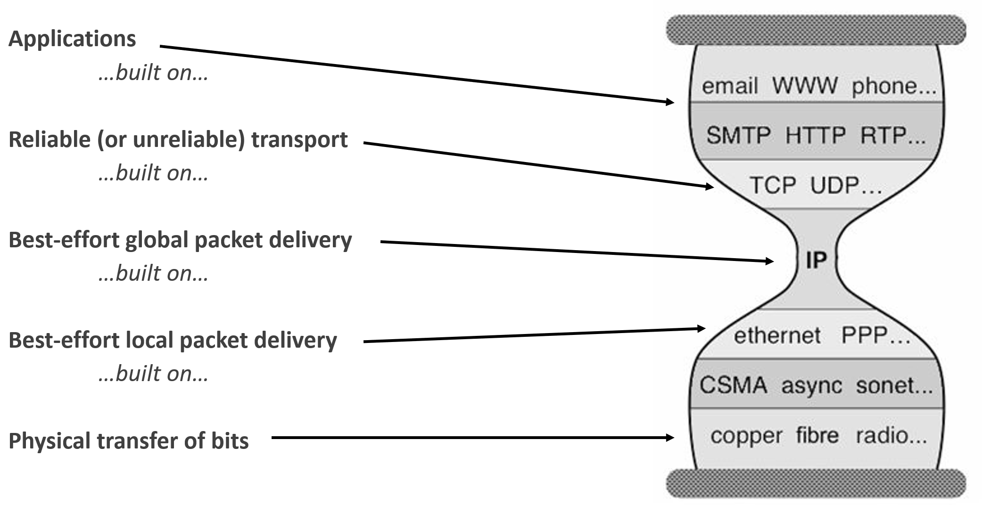

# 概览二
# Communication
**Internet** should allow **processes on different hosts to exchange data**

# 数据交换协议
- 模块化是好的复杂系统的关键
**Modularity**, based on **abstraction**（抽象）, is the way things get done

**Network designers** organize protocols in layers and the network hardware/software that implement them
## Models of communication networks
- Internet’s layer models
	- TCP/IP model: 
		It identifies 4 layers.
	- Hybrid TCP/IP model: It distinguishes 5 layers.
- Standard model of networks of open systems (OSI)
	it can be used for **any kind of communication systems**

| 层级    | 名称                | 功能简述                            | 典型协议/设备                                 |
| ----- | ----------------- | ------------------------------- | --------------------------------------- |
| **7** | 应用层（Application）  | 为用户应用提供网络服务接口（如浏览器、邮件客户端）       | HTTP, FTP, SMTP, DNS                    |
| **6** | 表示层（Presentation） | 数据格式转换、加密解密、压缩解压（确保不同系统能理解彼此数据） | SSL/TLS, JPEG, MPEG                     |
| **5** | 会话层（Session）      | 建立、管理和终止会话（对话控制）                | NetBIOS, RPC, SIP                       |
| **4** | 传输层（Transport）    | 端到端可靠/不可靠数据传输、流量控制、错误恢复         | TCP, UDP                                |
| **3** | 网络层（Network）      | 逻辑寻址、路由选择（跨网络的数据包转发）            | IP, ICMP, OSPF, BGP                     |
| **2** | 数据链路层（Data Link）  | 在同一物理网络内可靠传输帧、MAC 地址寻址、差错检测     | Ethernet, PPP, Wi-Fi (802.11), Switches |
| **1** | 物理层（Physical）     | 传输原始比特流（电压、光信号、频率等物理媒介）         | Cables, Hubs, Repeaters, Fiber          |

## TCP Model
 - Host-to-network or Link layer
	 - It depends on the LAN（Local Area Network，局域网）
- Internet or Network layer
	- Special packet format
	- Routing 
		- how **path** can be determined **between any two devices**
	- packet forwarding 
		- how packets need to be **forwarded to** follow their **routes**
- Transport layer
	- Transport Control Protocol  (TCP)
		- Reliable, **two-way** bytestream-based data transmission service
		- **Segmentation**, flow control, multiplexing
	- User Datagram Protocol  (UDP)
		- **Non-reliable** data transmission service
		- **No flow control**
- Application layer
	- Offers high level services: Telnet, FTP, SMTP, HTTP, NNTP, DNS, SSH, etc.

## ISO Model
1. **Physical Layer**
	- Service
		- Move information between two systems connected by a physical link
	- Interface
		- Specifies how to send _one bit__
	- Protocol
		- _Encoding_ scheme for _one bit_
		- Voltage levels
		- Timing of signals
2. **Data Link Layer**
	- Service
		- Data framing: _boundaries between packets_
		- Media access control (MAC)
			- 分配给每个网络接口控制器的**全球唯一标识符**
		- Per-hop reliability and _flow-control_
	- Interface
		- Send _one packet between two hosts_ connected to the same media
	- Protocol
		- Physical _addressing_ (e.g. MAC address)
3. **Network Layer**
	- Service
		- _Deliver packets_ across the network
		- Handle _fragmentation_/reassembly
		- Packet _scheduling_
		- _Buffer management_
	- Interface
		- Send one packet to a _specific destination_
	- Protocol
		- Define globally _unique addresses_
		- _Maintain routing tables_
4. **Transport Layer**
	- Service
		- _Multiplexing_/_demultiplexing_
		- Congestion control
		- Reliable, in-order delivery
	- Interface
		- Send message to a destination
	- Protocol
		- _Port numbers_
		- Reliability/error correction
		- Flow-control information
5. **Session Layer**
	- Service
		- _Access management_
		- _Synchronization_
	- Interface
		- Depends
	- Protocol
		- Token management
		- Insert checkpoints
6. **Presentation Layer**
	- Service
		- Convert data between different representations
	- Interface
		- It depends
	- Protocol
		- Define data formats
		- Apply transformation rules
7. **Application Layer**

## Hybrid model

L5. Application 
	- exchanges **messages** between **processes**.
	- HTTP, SMTP, FTP, SIP, …
L4. Transport  
	- transports **segments** between **end-systems**.
	- TCP, UDP, SCTP
L3. Network
	- moves **packets** around the **network**.
	- IP
L2. Link  
	- moves **frames** across a **link**.
	- Ethernet, Wifi, ADSL, WiMAX, LTE, …
L1. Physical  
	- moves **bits** across a **physical medium**.
	- Twisted pair, fiber, coaxial cable, …
![[Pasted image 20251224193345.png]]
**不同层将自己层的头数据添加在消息的头部外，接受到时逐层向内拆解直到实际消息**
![[Pasted image 20251224193408.png]]

**路由**
是L3层的门户
**交换机**
是L2层的门户

---