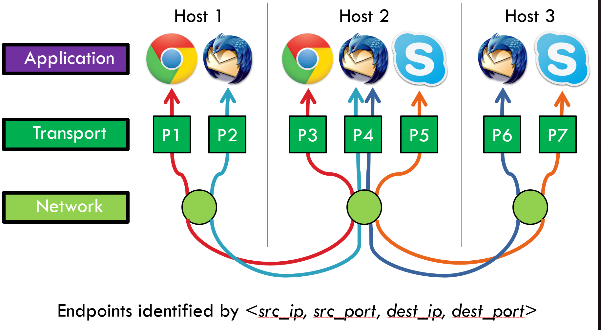
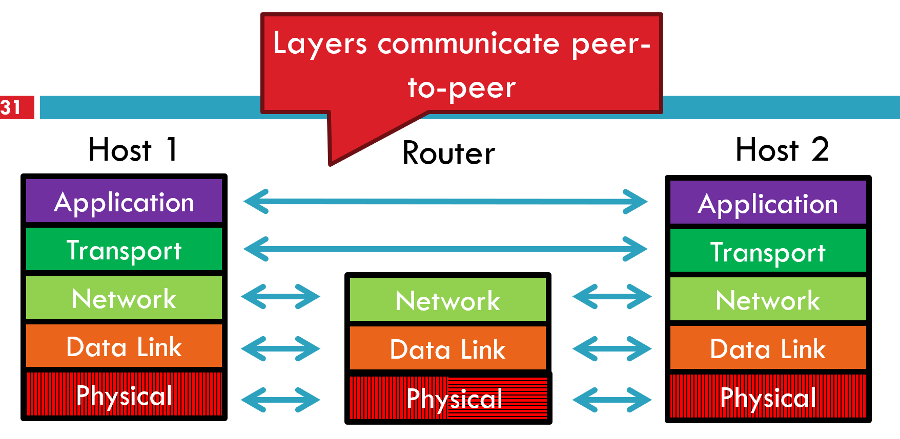

# 概述
## 功能
### 数据流的解复用（Demultiplexing）
#### 什么是 demultiplexing？
- 多个应用同时运行 → 发送数据包到网络
- 网络只看到 IP 地址和封装后的数据
- **传输层负责将接收到的数据包“分发”给正确的应用程序**
- 例如：
    - 你打开浏览器访问网页（HTTP）
    - 同时用 Skype 聊天（SIP/RTP）
    - 这两个应用都通过同一个 IP 地址通信
    - 传输层根据 **端口号（port number）** 区分它们

#### Demultiplexing Traffic（解复用流量）

##### 端点识别方式
`<src_ip, src_port, dest_ip, dest_port>`
这个四元组称为 **套接字（Socket）** 或 **五元组**（加上协议类型）

| 字段          | 说明                                       |
| ----------- | ---------------------------------------- |
| `src_ip`    | 源主机 IP 地址                                |
| `src_port`  | 源端口号（通常是临时端口）                            |
| `dest_ip`   | 目标主机 IP 地址                               |
| `dest_port` | 目标端口号（通常是知名端口，如 80/443）区分同一台主机上的不同网络通信进程 |
为什么需要源端口？
- 允许同一主机上的多个客户端连接同一个服务（如多个浏览器标签页访问同一网站）

| 端口范围          | 名称                                 | 说明                                                                                                                |
| ------------- | ---------------------------------- | ----------------------------------------------------------------------------------------------------------------- |
| 0 – 1023      | **知名端口（Well-known Ports）**         | 由 IANA 分配，用于标准服务。例如：   • HTTP → 80   • HTTPS → 443   • FTP → 21   • SSH → 22   • DNS → 53（UDP/TCP） |
| 1024 – 49151  | **注册端口（Registered Ports）**         | 可由用户或厂商向 IANA 注册使用，常用于特定应用程序（如 MySQL 默认 3306）。                                                                    |
| 49152 – 65535 | **动态/私有端口（Dynamic/Private Ports）** | 通常由操作系统临时分配给客户端程序作为**源端口**，也称为“短暂端口”（Ephemeral Ports）。                                                            |
##### 服务器如何处理多个客户端？
- 服务器监听固定端口（如 HTTP: 80）
- 每个客户端连接时使用随机源端口
- 服务器通过 `(src_ip, src_port)` 区分不同的客户端会话
### 多路复用的使用
> **如果没有传输层，操作系统无法区分来自同一 IP 的不同应用数据**

| 条目                                                  | 解释                                                                           |
| --------------------------------------------------- | ---------------------------------------------------------------------------- |
| **Datagram network**                                | 现代互联网基于无连接的分组交换（IP 是 datagram network）   → 没有回路、没有预先建立连接                  |
| **Clients run many applications at the same time**  | 用户可能同时运行多个程序（如浏览网页 + 收邮件 + 视频通话）                                             |
| **Who to deliver packets to?**                      | 问题来了：当一个 IP 数据包到达主机，怎么知道该交给哪个应用？                                             |
| **IP header “protocol” field**                      | IP 头部有一个 8 位字段叫 `Protocol`，用于标识上层协议   例如：6=TCP，17=UDP   最多支持 256 种不同协议 |
| **Insert Transport Layer to handle demultiplexing** | 所以引入传输层，专门解决“**把数据交给哪个应用**”的问题                                               |

---
## Optional functions
长连接、可靠有序交付、错误检测、流量与拥塞控制
这些功能不是所有传输协议都提供：

| 功能                                     | 说明                      |
| -------------------------------------- | ----------------------- |
| **Creating long-lived connections**    | 如 TCP 建立连接（三次握手），维持会话状态 |
| **Reliable, in-order packet delivery** | 确保所有数据按顺序到达，丢失重传（如 TCP） |
| **Error detection**                    | 使用校验和（checksum）检测传输错误   |
| **Flow and congestion control**        | 控制发送速率，避免接收方过载或网络拥塞     |

---
## Key challenges
检测并响应拥塞、平衡公平性与高利用率
- 传输层需要设计算法（如 TCP Reno）来实现“公平共享”

|挑战|解释|
|---|---|
|**Detecting and responding to congestion**|网络拥堵时如何感知？如何降低发送速率？（如 TCP 的慢启动、拥塞避免）|
|**Balancing fairness against high utilization**|多个用户共享带宽时，既要保证公平分配，又要尽可能高效利用资源|

# Layering, Routing, and End-to-End Communication

展示两台主机（Host 1 和 Host 2）之间通信，中间经过一个路由器。
每一层之间都有水平箭头，表示 **对等层之间的通信**（peer-to-peer communication）

---
## 核心思想
### Layers communicate peer-to-peer
- 尽管数据是从上往下封装、再从下往上解封装
- 但从逻辑上看，**各层之间是“对等通信”**
- 例如：
	- Host 1 的 Transport 层与 Host 2 的 Transport 层直接交互
- **每一层只关心自己的职责，不关心其他层细节**

###  Lowest level end-to-end protocol
- **传输层是最低级别的端到端协议**
- 即：
	- 只有源主机和目的主机才能读取传输层头部信息
- **路由器**不会查看传输层头部（它只看网络层 IP 头部）
- **举个例子：**
	- 你在电脑上用 Chrome 下载文件
	- 中间的路由器只知道“这是发往 208.67.222.123 的数据包”
	- 它不知道你是用浏览器还是 FTP 下载的
	- 只有你的电脑和目标服务器才知道这是 TCP 连接、端口 80、HTTP 请求

### 重要意义
传输层是整个网络体系中**最关键的一环之一**，它解决了以下几个根本问题：
1. **如何让多个应用共存于一台主机？**
2. **如何确保数据准确送达目标程序？**
3. **如何实现可靠传输而不依赖底层网络？**

# UDP
![[Pasted image 20260102170040.png]]

| 字段               | 长度      | 说明               |
| ---------------- | ------- | ---------------- |
| Source Port      | 16 bits | 源端口号             |
| Destination Port | 16 bits | 目的端口号            |
| Payload Length   | 16 bits | 数据部分长度（含 UDP 头部） |
| Checksum         | 16 bits | 校验和，用于错误检测       |
> 总共 32 位 = 4 字节 × 2 行 → 共 8 字节头部

---
## 特性
### Simple, connectionless datagram
- UDP 是一种 **简单、无连接的分组协议**
- 不需要建立连接（不像 TCP 的三次握手）
- 发送方直接发送数据包，接收方收到后处理
- 没有确认机制、没有重传、没有流量控制
- UDP 就像发短信：发出去就不管了，对方能不能收到不知道

### Port numbers enable demultiplexing
- 端口号是实现 **多路复用/解复用（Multiplexing/Demultiplexing）** 的关键
- 每个**应用**通过端口来标识自己

|字段|说明|
|---|---|
|**16 bits = 65535 possible ports**|从 0 到 65535 共 65536 个端口|
|**Port 0 is invalid**|端口 0 被保留，不能使用|
#### 端口分类
- **Well-known ports (0–1023)**：系统服务专用
    - 如 HTTP: 80, HTTPS: 443, DNS: 53, SSH: 22
- **Registered ports (1024–49151)**：注册给特定应用
- **Ephemeral ports (49152–65535)**：临时端口，由客户端动态分配

### Checksum for error detection
- UDP 提供了一个可选的 **校验和（Checksum）字段**，用于检测传输过程中的比特错误
- 计算方式基于**整个 UDP 报文**（包括伪头部、UDP 头部、数据）
#### 特性
- 校验和不是强制的（在 IPv4 中可选，在 IPv6 中必须）
- 只能检测出 **某些类型的损坏**（如单比特错误、奇偶性错误）
- **无法检测以下情况**：
    - 数据包丢失（没收到）
    - 数据包重复（收到了两次）
    - 数据包乱序（顺序打乱）
- 因为 UDP 设计目标是 **轻量级、低延迟**
- 如果要保证可靠性，由上层应用自己实现（如 RTP over UDP）

---
## 使用
| 条目                                              | 说明                         |
| ----------------------------------------------- | -------------------------- |
| **Invented after TCP**                          | UDP 出现在 TCP 之后             |
| **Why?**                                        | 因为并非所有应用都能容忍 TCP 的复杂性和延迟   |
| **Not all applications can tolerate TCP**       | 有些场景对实时性要求极高，不能等重传         |
| **Custom protocols can be built on top of UDP** | 应用可以自己定义可靠性、顺序、流控等机制       |
| **Examples**                                    | RTMP、实时媒体流、Facebook 数据中心协议 |

### 为何 UDP 在 TCP 之后出现？
- TCP 是 1974 年设计的，目的是提供 **可靠、有序、面向连接** 的通信
- 但后来发现：很多应用不需要这些特性
- 于是提出了 UDP：**简化版传输协议，只为那些不需要“保障”的应用服务**
- **TCP 是“安全第一”，UDP 是“速度优先”**

### 哪些应用适合 UDP？
当**延迟（latency）比可靠性更重要**
- **及时性 > 完整性**

| 场景             | 问题                                 | 解决方案                    |
| -------------- | ---------------------------------- | ----------------------- |
| **语音通话（VoIP）** | 若某个包丢失，TCP 会重传 → 导致延迟增大 → 听起来卡顿或回声 | 使用 UDP + 自定义纠错算法（如 FEC） |
| **视频直播**       | 用户更希望看到连续画面，哪怕有少量马赛克               | 接受丢包，不等待重传              |
| **在线游戏**       | 实时性强，延迟敏感                          | 快速响应更重要，宁愿跳帧也不卡顿        |

### 在 UDP 上自定义构建协议
由于 UDP 不提供任何高级功能，开发者可以在其上构建自己的协议，例如：

|协议|功能|
|---|---|
|**RTP (Real-time Transport Protocol)**|用于音视频流传输   - 添加序列号 → 检测乱序   - 时间戳 → 同步播放   - 可选重传机制|
|**QUIC**|Google 开发的现代传输协议   - 基于 UDP，支持多路复用、加密、快速握手   - 已被 Chrome 和 HTTP/3 采用|
|**DNS**|查询域名解析   - 通常使用 UDP（小数据包）   - 若超过 512 字节则降级到 TCP|
- 更灵活，可根据需求定制
- 避免 TCP 的拥塞控制限制（如慢启动）
- 可绕过中间设备的 TCP 优化策略（如 NAT、防火墙）

#### 具体例子
##### RTMP / Real-time Media Streaming
- Adobe 开发的协议，用于直播推流
- 基于 TCP 或 UDP（取决于实现）
- 使用 UDP 可减少延迟，适合直播场景

##### Facebook Datacenter Protocol
- Facebook 自研的内部数据中心通信协议
- 使用 UDP 作为底层传输
- 优点：
    - 低延迟
    - 高吞吐
    - 可自定义拥塞控制算法（如 BBR 的变种）
- 无需 TCP 的复杂状态机，更适合大规模集群通信

# TCP (Transmission Control Protocol)
![[Pasted image 20260102172003.png]]

---
## 关键特性
- **可靠的、有序的、双向字节流**
    - TCP 提供端到端的可靠数据传输，确保数据按顺序到达，且不丢失。
- **端口号用于多路分解（Demultiplexing）**
    - 使用源端口和目的端口来区分不同应用程序的数据流（例如，浏览器 vs 邮件客户端）。
- **虚拟电路（连接）**
    - TCP 是面向连接的协议，通信前需先建立“逻辑连接”。
- **流量控制（Flow control）**
    - 防止发送方发送过快导致接收方缓冲区溢出，使用滑动窗口机制。
- **拥塞控制 & 近似公平性（Congestion control, approximate fairness）**
    - 控制网络中的数据量以避免网络拥塞，并在多个连接之间分配带宽相对公平。

---
## 报文字段含义
| 字段                           | 说明                        |
| ---------------------------- | ------------------------- |
| **Source Port (0–15)**       | 发送方端口号                    |
| **Destination Port (16–31)** | 接收方端口号                    |
| **Sequence Number**          | 当前报文段第一个字节的序列号，用于保证顺序     |
| **Acknowledgement Number**   | 确认收到的下一个期望字节编号            |
| **HLen (Header Length)**     | TCP 头部长度（单位：4字节）          |
| **Flags**                    | 控制标志位（如 SYN, ACK, FIN 等）  |
| **Advertised Window**        | 接收方当前可接收的字节数（用于流量控制）      |
| **Checksum**                 | 校验和，用于检测传输错误              |
| **Urgent Pointer**           | 指示紧急数据的位置（仅当 URG 标志置位时有效） |
| **Options**                  | 可选字段，用于扩展功能（如最大段大小 MSS）   |
使用这些字段的目的是为了：
- 可靠性 → 因为底层 IP 不可靠；
- 流量/拥塞控制 → 防止网络崩溃或资源浪费。

---
## 连接准备
### 为什么需要
**为了在双方主机上建立状态信息**
- 特别是 **序列号（sequence numbers）**，这是TCP的核心机制之一。
    - 序列号用来跟踪已发送的字节数。
    - 初始值是**随机选择的**（称为 ISN: Initial Sequence Number），防止旧连接的重复报文干扰新连接（防重放攻击）。
	    - 防止攻击者预测初始序列号发起伪造连接。
**重要 TCP 标志位（各占1比特）**
- **SYN（Synchronize）**：用于发起连接请求（同步序列号）
- **ACK（Acknowledge）**：确认接收到的数据
- **FIN（Finish）**：表示发送方完成数据发送，准备关闭连接

---
## 三次握手
![[Pasted image 20260102175153.png]]
1. **Client → Server**:  
    `SYN <SeqC, 0>`
    - 客户端发送 SYN 包，携带自己的初始序列号 `SeqC`，确认号为 0（因为还未收到对方数据）。
2. **Server → Client**:  
    `SYN/ACK <SeqS, SeqC+1>`
    - 服务器回复 SYN 和 ACK：
        - 自己的初始序列号 `SeqS`
        - 确认客户端的 `SeqC`，因此 ACK = `SeqC + 1`
3. **Client → Server**:  
    `ACK <SeqC+1, SeqS+1>`
    - 客户端确认服务器的 `SeqS`，即 ACK = `SeqS + 1`
每一方的作用：
- 告知对方自己的起始序列号；
- 确认对方的起始序列号。
- 这个过程确保了双方都知晓彼此的起始序列号，建立了可靠的双向通信通道。

---
## 四次挥手
![[Pasted image 20260102175545.png]]
- 任意一方都可以发起关闭（通常是客户端或服务端主动关闭）
- 对方可能仍在发送数据 → 支持 **半打开连接（half-open connection）**
    - 使用 `shutdown()` 函数可以只关闭一方向的通信
- 必须确认最后一个 FIN 包
    - 关闭时使用 `FIN` 标志，确认后用 `ACK` 响应
    - 应答的序列号是 `原序列号 + 1`（同理于 ACK 规则）

1. **Client → Server**: `FIN <SeqA, *>`
    - 客户端通知服务器自己要关闭连接，发送 FIN，序列号为 `SeqA`
2. **Server → Client**: `ACK <* , SeqA+1>`
    - 服务器确认收到 FIN，继续发送数据（可选）
3. **Server → Client**: `FIN <SeqB, *>`
    - 服务器也想关闭，发送自己的 FIN
4. **Client → Server**: `ACK <* , SeqB+1>`
    - 客户端确认服务器的 FIN，连接完全关闭
两个方向各一次 FIN + 两次 ACK，共四步。

---
## 总结

|内容|关键概念|
|---|---|
|**TCP 特性**|可靠、有序、双向、基于连接、有端口、支持流量与拥塞控制|
|**TCP 报文头**|含源/目的端口、序号、确认号、标志位、窗口大小等|
|**连接建立**|三次握手（SYN → SYN/ACK → ACK），同步双方序列号|
|**连接关闭**|四次挥手（FIN → ACK → FIN → ACK），支持半关闭|
|**安全设计**|初始序列号随机化防止重放攻击|
|**可靠性机制**|序列号、ACK、重传、超时重试等|

# TCP 协议机制
## Sequence Number Space（序列号空间）
### 序列号管理
![[Pasted image 20260102180432.png]]
**要点解析：**
1. **TCP 使用字节流抽象（Byte Stream Abstraction）**
    - TCP 将应用程序的数据视为一个连续的字节流。
    - 每个字节都有唯一的编号（sequence number），从初始值开始递增。
    - 这使得接收方能正确重组乱序到达的数据包。
2. **32位序列号，可循环（wraps around）**
    - 序列号是 **32位无符号整数**，最大值为 $2^{32}−1≈4.3×10^9$ 字节（约 4GB）。
    - 当达到最大值后会**回绕（wrap around）** 到 0。
    - 但为了避免混淆旧连接和新连接，初始序列号是随机选择的（ISN: Initial Sequence Number）。
3. **为什么初始序列号要随机？**
    - 防止**重放攻击（replay attack）**：如果攻击者截获旧连接的报文并重复发送，可能会欺骗服务器。
    - 随机 ISN 可以有效防止这种攻击。
4. **字节流被分割成段（segments）**
    - 数据在传输前被划分为多个 TCP 段（即报文段）。
    - 每个段的大小受限于 **MSS（Maximum Segment Size）**。
        - MSS 是 TCP 层允许的最大数据部分长度（不包括 TCP 头部）。
        - 通常由路径 MTU 决定（如以太网 MTU 为 1500 字节，减去 IP 和 TCP 头部后约为 1460 字节）。
5. **每个段都有自己的序列号**
    - 图中显示：
        - Segment 8: 起始序列号 = 13450
        - Segment 9: 起始序列号 = 14950 → 表示该段包含 $14950 - 13450 = 1500$ 字节
        - Segment 10: 起始序列号 = 16050 → 包含 1100 字节
    - 所有段都按顺序编号，便于接收端重组。
TCP 的“字节流”模型 + 序列号机制，实现了可靠、有序的数据传输。

---
## Bidirectional Communication
![[Pasted image 20260102180717.png]]
第一次交互：
- 客户端发送 `Data (1460 bytes)`，起始序列号 = 1
- 服务器收到后，返回 `ACK=1461`（表示期望下一个字节是 1461）
- 同时服务器也发送自己的数据（730 字节），起始序列号 = 23

 第二次交互：
 - 客户端收到服务器的数据（730 字节），于是 ACK = 23 + 730 = 753
 - 同时客户端继续发送数据（1460 字节），起始序列号 = 1461

红色框强调：
- 这就是 **捎带确认（piggybacking）** 技术。
- 提高效率：不需要单独发 ACK 包，而是把 ACK 和数据合并到一个包里。

**TCP 支持全双工通信**
**要点解析：**
- TCP 是**双向通信协议**，客户端和服务器都可以同时发送和接收数据。
- 每个方向都有独立的序列号和确认号。
- 因此，**两个方向的序列号是分开管理的**。

|方向|发送方|接收方|Seq.|Ack.|
|---|---|---|---|---|
|Client → Server|客户端发数据|服务器收|1|23|
|Server → Client|服务器回复|客户端收|23|1|

---
## Flow Control
 如何防止发送方压垮接收方？
- 如果发送方发送太快，而接收方处理慢，会导致缓冲区溢出。
- 接收方的缓冲区大小可能随时间变化（比如正在处理其他任务）。

### 滑动窗口（Sliding Window）
- 接收方告诉发送方自己还能接收多少数据 → 称为 **advertised window（通告窗口）**
- 发送方只能在“窗口内”发送数据，不能超过这个限制。
- 窗口大小可以动态调整。
#### 关键规则：
- 若窗口大小为 `n`，则发送方最多可以发送 `n` 字节而不等待 ACK。
- 每收到一个 ACK，窗口向前滑动（即允许发送更多数据）。
- 窗口可能变为 0！此时发送方必须停止发送，直到收到新的非零窗口通知。

#### 发送者视角
![[Pasted image 20260102181232.png]]

| 区域                 | 含义                |
| ------------------ | ----------------- |
| **ACKed**          | 已经被确认的数据（已成功送达）   |
| **Sent**           | 已发送但尚未被确认的数据（需缓存） |
| **To Be Sent**     | 准备发送但还未发出的数据      |
| **Outside Window** | 超出当前窗口范围，不能发送     |

##### 关键流程：
1. 发送方根据接收到的 **ACK** 和 **Window 字段** 更新窗口位置。
2. **绿色箭头**：表示发送方将数据放入“待发送队列”（To Be Sent）。
3. **橙色箭头**：表示接收方返回的 ACK 和 Window 值。
4. **红色区域**：表示不能发送的数据（超出窗口）。

- 所有“已发送但未确认”的数据必须**缓存**（buffered），直到收到 ACK。
- 如果窗口变小或为 0，发送方必须暂停发送。

#### Sliding Window Example
![[Pasted image 20260102181425.png]]
1. 发送方连续发送 1~6 号包。
2. 接收方逐个 ACK，窗口逐渐滑动。
3. 第 5 号包丢失（红叉标记）→ 接收方无法确认后续包。
4. 发送方未收到 ACK，因此不会滑动窗口，持续重传 5 号包。
5. 最终 5 号包被重传成功，接收方返回 ACK，窗口继续滑动。

- TCP 的发送速度取决于 ACK 的返回频率。
- **短 RTT（往返时间）→ 快速 ACK → 窗口快速滑动 → 高吞吐量**
- **长 RTT → 慢速 ACK → 窗口滑动缓慢 → 吞吐量低**
实际影响：
- 在高速网络中（如局域网），RTT 很短，TCP 能高效利用带宽。
- 在卫星链路等高延迟网络中，即使带宽很高，吞吐量也会受限于 ACK 的延迟。
重传机制：
- 若某个包长时间未收到 ACK，发送方会超时重传。
- 一旦收到 ACK，窗口立即滑动，继续发送后续数据。

---
## Observations
### TCP 滑动窗口下的重要特性
1. **Throughput** 
	$$\frac{w}{RTT}$$
	- 吞吐量 ≈ 窗口大小 ÷ 往返时间(s)
    - 公式含义：
        - `w`：发送窗口大小（单位：字节）
        - `RTT`：往返时间（Round-Trip Time），即数据包从发送到收到ACK的时间
        - 在理想情况下，发送方在每个RTT内可以发送一个完整的窗口数据。
        - 所以平均吞吐量为：`w / RTT`
    - 💡 举个例子：
        - 如果窗口是 64 KB，RTT 是 100 ms，则最大吞吐量约为：
            $\frac{64×1024}{0.1}​=655360 B/s≈5.2 Mbps$
2. **Sender has to buffer all unacknowledged packets**
    - 发送方必须缓存所有未被确认的数据包。
    - 原因：一旦发生丢包或网络延迟，这些数据可能需要重传。
    - 因此，发送端需要有足够的内存来保存“已发但未确认”的数据。
3. **Receiver may accept out-of-order packets, but only up to buffer limits**
    - 接收方可以接收乱序到达的数据包，但只能在缓冲区容量允许范围内。
    - TCP 使用滑动窗口机制，允许接收方暂存后续到达的包（如先收到第3包，再收到第2包）。
    - 但如果缓冲区满了，就会拒绝新包并可能导致拥塞。

### 接收方应如何响应 ACK？
| 编号  | 策略                     | 说明                                                                                      |
| --- | ---------------------- | --------------------------------------------------------------------------------------- |
| 1   | ACK every packet       | 每收到一个包就发一次 ACK —— 高开销，不实用                                                               |
| 2   | Cumulative ACK(默认行为)   | 累积确认：ACK n 表示“我已经收到了所有 ≤ n 的包”   👉 如收到包 1,2,3 → 发 ACK=4   优点：节省带宽；缺点：无法告知哪些包丢失   |
| 3   | Negative ACKs (NACKs)  | 显式指出哪个包没收到（例如：“我缺第5包”）   优点：能快速反馈缺失信息   缺点：增加复杂度，不是标准 TCP 实现                      |
| 4   | Selective ACKs (SACKs) | ✅ 最优方案！表示“我收到了某些非连续的包”，即使乱序也接受   例如：收到 1,2,4,5 → 可以 SACK=1,2,4,5   → 发送方知道只需重传第3包 |
- **SACK 是 TCP 的扩展功能**（RFC 2018），需双方支持。
- 它解决了“仅靠累积 ACK 导致大量重传”的问题。
- 提高了网络效率，尤其在网络不稳定时表现更好

### Sequence Numbers
- **32 bits, unsigned**
    - 序列号范围：0 到 $2^{32}−1≈4.3×10^9$ 字节（约 4GB）
    - 可以循环使用（wrap around）
	- 32 位序列号不仅用于标识字节位置，还承担了**防混淆、抗重放攻击、避免迷途包**的重要作用。
1. **Why so big?**
- 为了满足以下两个需求：
    a. **防止序列号空间耗尽**
    - 若窗口太大，可能会出现旧序列号被误认为新数据的问题。
    - 必须保证：
        $∣Sequence Space∣>2×∣Sending Window Size∣$
        - 即：序列号空间至少是窗口大小的两倍
        - 通常窗口大小最多为 216=65536 字节（早期限制）
        - 所以 $2^{32}>2×2^{16}$，满足条件
    
    b. **Guard against stray packets（防范迷途包）**
    - IP 包有最大生存时间（Maximum Segment Lifetime, MSL）为 **120 秒**
    - 意味着一个包最多在网络中停留 2 分钟
    - 如果序列号太小，可能在旧连接结束后，旧包仍存在网络中，被新连接误认
    - 32 位序列号确保即使经过多次回绕，也能区分新旧连接

### Silly Window Syndrome
#### 当窗口太小时会发生什么？
- 如果窗口大小非常小（比如每次只允许发 1 字节），会导致：
    - 发送大量极小的数据包（如每包只有 1 字节数据 + 20 字节 TCP 头 + 20 字节 IP 头）
    - 头部开销远大于有效载荷 → **效率极低**

#### Nagle’s Algorithm
解决 Silly Window Syndrome
1. **如果窗口 ≥ MSS 且可用数据 ≥ MSS：直接发送完整包**
    - 发送一个满载的段（full packet）
2. **否则，如果有未确认的数据：将新数据放入缓冲区，等待 ACK**
    - 不立即发送，避免产生多个小包
3. **否则：发送当前数据**
    - 当前没有未确认数据，也没有足够数据填满 MSS → 发送非满包
- 减少小包数量，提高链路利用率
- 牺牲一点延迟换取更高的吞吐量

### Error Detection
> TCP 用“校验和 + 序列号 + 超时机制”构建了一个强大的错误检测与恢复系统。
1. **Checksum detects (some) packet corruption**
    - 校验和覆盖整个 TCP 报文（包括 IP 头、TCP 头、数据）
    - 可检测出部分比特翻转错误（但不是全部）
    - 注意：IPv4 校验和由 IP 层计算，TCP 再做一次校验
2. **Sequence numbers catch sequence problems**
    - 通过序列号识别以下异常：
        - **Duplicate packets**：重复包 → 忽略
        - **Out-of-order packets**：乱序包 → 缓存或重新排序
        - **Missing sequence numbers**：发现空缺 → 认为包丢失 → 触发重传
3. **Lost segments detected by sender**
    - 发送方通过 **timeout** 检测是否丢失 ACK
    - 需要估计 RTT 来设定合理的超时时间
    - 发送方必须保留所有未确认数据的副本，直到收到 ACK

### Retransmission Time Outs (RTO)
![[Pasted image 20260102193907.png]]
1. **Timeout too short**：
    - 网络正常，但 ACK 延迟稍长 → 被误判为丢包 → 重传
    - 造成不必要的重传，浪费资源
2. **Timeout too long**：
    - 真正丢包后很久才重传 → 响应慢 → 吞吐量下降
- 需要动态估算 RTT，并据此调整 RTO

### Round Trip Time Estimation（RTT 估计）
![[Pasted image 20260102194220.png]]
**原始 TCP RTT 估计算法：**
- 使用**指数加权移动平均**（EWMA）：
    $$new_{rtt}=α * old_{rtt}+(1−α)⋅new_{sample}$$
- 推荐 α 值：0.8~0.9（常用 0.875）
- 优点：平滑波动，适应网络变化
- TCP 保守起见，设为两倍 RTT，避免频繁超时

### RTT Sample Ambiguity（RTT 样本歧义）
![[Pasted image 20260102194209.png]]
- 当初始发送失败，重传成功后收到 ACK，这个 ACK 时间是来自哪次发送？
- 是第一次发送的 RTT？还是第二次重传的 RTT？

**Karn’s Algorithm（卡恩算法）：**
- **忽略重传段的 RTT 样本**
- 只对首次发送成功的包进行 RTT 测量
- 防止因重传导致 RTT 低估，从而引发过多重传

---
## TCP 拥塞控制（TCP Congestion Control）
TCP 拥塞控制的核心是 **通过调整 cwnd 来控制发送速率**，从而避免网络过载。
### 因素
1. **The network is congested if the load in the network is higher than its capacity.**
    - 当网络中的流量负载超过其处理能力时，就会发生**拥塞**。
    - 表现为：丢包率上升、延迟增加、吞吐量下降。
2. **Each TCP connection has a window**
    - 每个 TCP 连接都有一个“窗口”（window），用于控制未被确认的数据量。
    - 窗口大小决定了发送方可以发送多少数据而不等待 ACK。
3. **Controls the number of unACKed packets**
    - 发送方不能发送超过窗口大小的数据。
    - 所有已发送但尚未收到 ACK 的数据都属于“未确认”状态。
4. **Sending rate is ~ window / RTT**
    - 发送速率 ≈ 窗口大小 ÷ 往返时间
    - 例如：若窗口为 64 KB，RTT 为 100ms，则理论最大发送速率为：
	    - $\frac{64×1024}{0.1}​=655360 B/s≈5.2 Mbps$
- 解决方案
1. **vary the window size to control the send rate**
	- 关键思想：通过动态调整窗口大小来调节发送速率。
	- 如果网络拥堵 → 减小窗口 → 降低发送速度
	- 如果网络空闲 → 增大窗口 → 提高发送速度
 2. **Introduce a congestion window at the sender**
- 引入 **cwnd（congestion window）**：由**发送方**维护的变量，表示当前允许发送的字节数。
- 注意：这是**发送端的问题**，即拥塞控制主要在发送方实现。

### Two Basic Components
#### Detect congestion（检测拥塞）
拥塞控制 = **检测 + 调整**
##### 相关特性
- TCP 是“ACK驱动”的协议：
    - 每收到一个 ACK，就允许发送新的数据
    - 发送速率由 ACK 到达频率决定
- **Congestion = delay = long wait between ACKs**
    - 拥塞表现为 ACK 之间的时间间隔变长
    - 说明数据传输慢，可能是中间链路排队严重
- **No congestion = low delay = ACKs arrive quickly**
    - 网络通畅时，ACK 快速返回，发送方能持续高速发送
##### 解决方式
- **Packet dropping is most reliably signal**
    - 数据包丢失是最可靠的拥塞信号。
    - 因为路由器在缓冲区满时会丢弃数据包，而丢包意味着网络已饱和
    1. **Timeout after not receiving an ACK**
	    - 超时未收到 ACK → 认为数据包丢失
	    - 触发重传
	2. **Several duplicate ACKs in a row**
	    - 接收方连续收到多个重复 ACK（如 ACK=100 多次）
	    - 表明某个包缺失 → 发送方可推断出该包丢失
- **Rate adjustment algorithm（速率调整算法）**
	1. **Modify cwnd**
	    - 改变拥塞窗口大小是核心手段
	2. **Probe for bandwidth**
	    - 逐步试探网络可用带宽
	    - 初始阶段快速探测（Slow Start），之后稳定增长（Congestion Avoidance）
	3. **Responding to congestion**
	    - 当检测到拥塞（丢包）时，减少 cwnd
	    - 目标：让所有连接共享带宽，避免“饿死”现象
	    - Rate Adjustment
			1. **Upon receipt of ACK: increase cwnd**
			    - 收到 ACK → 认为数据成功送达 → 可以尝试加快发送
			    - cwnd 增加 → 允许发送更多数据
			    - cwnd 增长与 RTT 成正比（因为每个 ACK 都代表一次 RTT （数据往返时间））
			2. **On loss: decrease cwnd**
			    - 数据包丢失 → 认为存在拥塞 → 必须减小发送速率
			    - cwnd 减少 → 发送更少数据，缓解网络压力
-  基于延迟的方法（如 RTT 变化）**不可靠**：
    - 网络延迟可能因多种原因波动（如路由变化、干扰等）
    - 容易误判拥塞或忽略真实拥塞

#### Congestion Control
**维护三个变量：**

| 变量         | 含义                                                                                 |
| ---------- | ---------------------------------------------------------------------------------- |
| `cwnd`     | 拥塞窗口（Congestion Window）—— 发送方根据网络状况动态调整 - 表示 **当前网络能够承受的、未被确认的数据量上限**。          |
| `adv_wnd`  | 接收方通告的窗口（Advertised Window）—— 受限于接收缓冲区大小 - 表示 **接收方当前还能接收多少字节的数据**（即接收缓冲区剩余空间）。 |
| `ssthresh` | 拥塞阈值（Slow Start Threshold）—— 决定何时从 Slow Start 切换到 Congestion Avoidance             |

**实际使用的窗口大小：**
`wnd=min(cwnd,adv_wnd)`
- 实际发送不能超过这两个窗口中的较小者
- 既要考虑网络容量（cwnd），也要考虑接收方能力（adv_wnd）
**两个阶段的拥塞控制：**
##### 1. Slow start（慢启动）
![[Pasted image 20260102195809.png]]
- **Knee**：最佳工作点，此时吞吐量最大且稳定
- **Cliff**：超过此点后，网络崩溃，吞吐量急剧下降
- 慢启动执行
	- 当 `cwnd < ssthresh` 时执行
	- 目标：快速探测网络瓶颈带宽
	- cwnd 指数增长
###### 过程：
1. **初始化：**
    - `cwnd = 1`（只能发送一个 MSS（Maximum Segment Size） 大小的数据段）
    - `ssthresh = adv_wnd`（初始阈值设为接收方窗口）
2. **每次收到 ACK：cwnd++**
    - 每个 ACK 到达，cwnd 加 1
    - 由于每次发送的数据段数量等于 cwnd，因此 cwnd 会呈**指数增长**
3. **终止条件：**
	- 达到 `ssthresh`（进入拥塞避免阶段）
	- 或发生丢包（触发拥塞响应）
###### 示例
![[Pasted image 20260102200023.png]]
- 初始 `cwnd = 1` → 发送 1 个段（编号 1）
- 收到 ACK → `cwnd = 2` → 发送 2 个段（2,3）
- 收到两个 ACK → `cwnd = 4` → 发送 4 个段（4~7）
- 收到四个 ACK → `cwnd = 8` → 发送 8 个段
- cwnd 每轮翻倍（指数增长）
- 一旦 `cwnd >= ssthresh` 或出现丢包，就停止慢启动
- 极快地探测网络能力
##### 2. Congestion avoidance（拥塞避免）
-  当 `cwnd >= ssthresh` 时进入
- 使用 AIMD（Additive Increase Multiplicative Decrease）策略
- cwnd 缓慢线性增长，防止过度占用资源
###### 核心机制
**AIMD（Additive Increase, Multiplicative Decrease）**
- **Additive Increase**：缓慢增加
- **Multiplicative Decrease**：快速减少
- 如果 `cwnd >= ssthresh`，则：
    - $cwnd+= \frac{1}{cwnd}​$
	    - 每收到一个 ACK，cwnd 增加 `1/cwnd`
	    - 例如：当 cwnd=8 时，每收到一个 ACK，cwnd 增加 1/8
	    - 所以需要 8 个 ACK 才能让 cwnd 增加 1
- 这样设计
	- 避免“冲撞式”增长，防止再次触发拥塞
	- 保持平滑增长，接近最优吞吐量
- `ssthresh` 是对“拐点”的下界估计
- 一旦发生丢包，通常会将 `ssthresh` 设置为当前 `cwnd` 的一半（如 `ssthresh = cwnd / 2`）

###### 示例
![[Pasted image 20260102200402.png]]
- Slow Start：指数增长（1→2→4→8）
- Congestion Avoidance：线性增长（8→9→10→...）
- TCP 通过 **Slow Start + AIMD** 实现了：
	- 快速启动
	- 平稳运行
	- 自动适应网络条件
### 总结

| 阶段                       | 触发条件             | cwnd 变化                 | 特点        |
| ------------------------ | ---------------- | ----------------------- | --------- |
| **Slow Start**           | cwnd < ssthresh  | 每个 ACK → cwnd += 1      | 指数增长，快速探测 |
| **Congestion Avoidance** | cwnd >= ssthresh | 每个 ACK → cwnd += 1/cwnd | 线性增长，平滑稳定 |
#### 拥塞检测方式：
- 超时 → 丢包 → 减半 cwnd
- 重复 ACK（≥3）→ 快速重传 → 减半 cwnd

#### 典型行为：
- 新连接 → Slow Start → 快速提升 → 达到 ssthresh → 进入 AIMD → 平稳运行
- 若丢包 → cwnd 减半，ssthresh 更新 → 重新开始慢启动或进入拥塞避免

---
## TCP的进化
### TCP Tahoe（基础版本）
#### 阶段一：Slow Start（慢启动）
#### 阶段二：Congestion Avoidance（拥塞避免）
#### 拥塞检测方式：
- **仅依赖 Timeout（超时）**
    - 如果某个数据包未在 RTO（Retransmission TimeOut）内收到 ACK，则认为丢失
    - 触发重传，并将 `cwnd` 设为 1，重新开始 Slow Start
    - 同时将 `ssthresh` 设置为当前 `cwnd / 2`

### TCP Reno 
- 在 Tahoe 基础上增加了两个关键机制：
    - **Fast Retransmit（快速重传）**
    - **Fast Recovery（快速恢复）**
#### Fast Retransmit
- **当接收到 3 个重复 ACK（duplicate ACKs）时，立即重传丢失的数据包**
- 不需要等到超时！
- 接收方连续收到多个相同序列号的 ACK，说明中间有某个包没收到
- 例如：
    - 发送顺序：1, 2, 3, 4, 5
    - 包 3 丢失 → 接收方收到 4 → 发出 ACK=3（期望收到 3）
    - 继续收到 5 → 再次发出 ACK=3
    - 只要连续出现 3 次 ACK=3，发送方就知道包 3 丢失了
##### 示例
![[Pasted image 20260102201718.png]]
- 发送段 1~7
- 段 5 丢失（红色叉）
- 接收方收到 6、7 后仍期待段 5 → 发出多个 ACK=5
- 发送方收到 3 个 ACK=5 → 触发快速重传

##### 总结
- 大幅减少重传延迟
- 提升用户体验（尤其是对交互式应用）

#### Fast Recovery
- 快速重传解决了“等待时间过长”的问题
- 但仍然存在一个问题：如果直接把 `cwnd` 降到 1，会浪费已建立的连接状态
- **在快速重传后，不将 cwnd 重置为 1**
- 而是：
$$cwnd=\frac{cwnd}{2}​$$
$$ssthresh=\frac{cwnd}{2}​$$
- **避免不必要的慢启动阶段**
- 保留部分网络容量信息
- 减少因超时导致的性能下降

**注意**
- **只有在收到 3 个重复 ACK 时才执行 Fast Recovery**
- **如果 RTO 超时仍未收到 ACK，则仍需返回慢启动（cwnd = 1）**
    - 表明网络状况非常差，可能完全中断

#### 优化提升
![[Pasted image 20260102202054.png]]
- 左侧曲线：TCP Tahoe（仅 timeout）
    - 每次超时后 cwnd 归零 → 慢启动重启
    - 锯齿状剧烈波动
- 右侧曲线：TCP Reno（含 fast retransmit/recovery）
    - 出现小幅度“锯齿”而非大跳动
    - 在稳态下，cwnd 围绕最优窗口值小幅震荡
- **在稳定状态（steady state）下，cwnd 在最优窗口附近振荡**
- **TCP 会主动“强迫”丢包**，以维持公平性和防止缓冲区溢出
    - 例如：路由器故意丢弃尾部数据包（Tail Drop）
    - TCP 通过这种反馈机制自动调节发送速率

---
## TCP的变体

| TCP 变体      | 特点                                                                                                   |
| ----------- | ---------------------------------------------------------------------------------------------------- |
| **Tahoe**   | 原始版本   • Slow Start + AIMD   • 动态 RTO 基于 RTT 估计   • 仅靠超时检测丢包                                |
| **Reno**    | Tahoe + 两大增强   • **Fast Retransmit**：3 个重复 ACK 触发重传   • **Fast Recovery**：cwnd = cwnd/2，不回退到 1 |
| **NewReno** | 改进的 Fast Retransmit   • 每个重复 ACK 都触发一次重传（针对多包丢失）   • 问题：超过 3 个乱序包可能导致异常重传                      |
| **Vegas**   | 延迟感知型拥塞控制   • 不依赖丢包，而是根据 RTT 变化判断拥塞   • 更早反应，减少丢包率   • 适合高带宽、低延迟网络                          |
| ...         | 其他变体：CUBIC、BBR、Westwood、Compound TCP 等                                                               |
- **Reno**：通用性强，广泛使用
- **Vegas**：适用于科研网络、数据中心
- **CUBIC**：Linux 默认，适合高速网络
- **BBR**（Google 开发）：基于带宽和延迟模型，现代高性能选择

---
## TCP 拥塞控制的演进历程

|时间线|版本|主要贡献|
|---|---|---|
|1980s|**Tahoe**|第一代拥塞控制：   • Slow Start   • Congestion Avoidance   • 仅靠超时检测丢包|
|1990s|**Reno**|显著改进：   • Fast Retransmit（3 dupACKs）   • Fast Recovery（cwnd /= 2）   • 避免频繁慢启动|
|2000s|**NewReno, Vegas**|处理复杂场景：   • 多包丢失处理   • 延迟感知机制|
|2010s+|**CUBIC, BBR**|高速网络优化：   • 更智能的窗口调整   • 带宽估计与延迟控制|
# 传输层的演化
| 年份       | 事件                                                 | 背景说明                                                                                                                                                                 |
| -------- | -------------------------------------------------- | -------------------------------------------------------------------------------------------------------------------------------------------------------------------- |
| **1974** | **Origins of "TCP"** (Cerf & Kahn)                 | TCP 的起源年份，由 Vinton Cerf 和 Robert Kahn 提出，是互联网架构的核心协议之一。当时 TCP 同时承担了现在 IP 和 TCP 的功能。                                                                                  |
| **1975** | **3-way handshake** (Tomlinson)                    | 建立可靠连接的基础机制：SYN → SYN-ACK → ACK。用于确保双方都准备好通信。                                                                                                                        |
| **1981** | **TCP and IP** (RFC 791/793)                       | 正式分离 TCP 和 IP 协议：   - RFC 791: 定义 IP 协议   - RFC 793: 定义 TCP 协议   标志着现代 TCP/IP 模型的确立。                                                                        |
| **1983** | **TCP/IP "flag day"** (BSD Unix 4.2)               | BSD Unix 4.2 成为第一个广泛部署 TCP/IP 的操作系统。   “Flag Day”指网络系统正式切换到 TCP/IP 的标志性时刻。                                                                                        |
| **1986** | **Congestion collapse**                            | 网络出现严重拥塞崩溃现象：   - 大量主机发送数据，导致路由器队列溢出、丢包加剧   - 网络吞吐量急剧下降，几乎瘫痪   这一事件推动了 **TCP 拥塞控制机制** 的诞生。                                                                  |
| **1988** | **TCP Tahoe** (Jacobson)                           | 由 Van Jacobson 设计的第一个实用拥塞控制算法：   - 引入 **Slow Start**、**Congestion Avoidance**、**Fast Retransmit**（后续加入）   - 使用 **AIMD**（加法增、乘法减）策略   解决拥塞崩溃问题，成为现代 TCP 的基石。 |
| **1990** | **TCP Reno** (Jacobson)                            | 在 Tahoe 基础上改进：   - 加入 **Fast Retransmit**（收到 3 个重复 ACK 就重传）   - 加入 **Fast Recovery**（不回退到 cwnd=1）   大幅提升性能和响应速度，成为主流。                                       |
| **1993** | **TCP Vegas** (Brakmo)                             | 首次提出 **基于延迟的拥塞控制**：   - 不依赖丢包，而是通过 RTT 变化感知拥塞   - 更早反应，减少丢包率   适合高带宽、低延迟网络（如科研网）。                                                                           |
| **1994** | **ECN (Explicit Congestion Notification)** (Floyd) | 路由器主动通知拥塞，而不是丢包：   - 设置 ECN 标志位告知发送方“网络快满了”   - 减少不必要的丢包，提高效率   需要路由器支持（绿色框标注“Router support”）。                                                             |
| **1995** | **TCP New Reno** (Hoe)                             | 改进 Reno 对多个包丢失的处理：   - 支持连续重传多个丢失段   - 解决 Reno 中“单次快速重传无法恢复多包丢失”的问题                                                                                            |
| **1996** | **TCP with SACK** (Floyd)                          | 支持 **Selective Acknowledgment**：   - 接收方可报告哪些段已收到、哪些未收到   - 发送方可只重传缺失的数据包，避免盲目重传整个窗口                                                                           |
### Transport layer evolution — 扩展版时间线
#### 现代 TCP 变体（2000s–2010s）：

|名称|特点|应用场景|
|---|---|---|
|**FAST TCP** (Low et al., '04)|基于延迟的拥塞控制，更激进的增长策略|科研、数据中心|
|**TCP BIC** (Linux, '04)|Binary Increase Congestion Control，适用于高带宽网络|Linux 内核早期使用|
|**TCP CUBIC** (Linux, '06)|基于立方函数控制窗口大小，适应高速网络|当前 Linux 默认算法|
|**Compound TCP** (Windows, '07)|结合延迟感知 + 丢包感知双窗口机制|Windows 系统默认|
|**DCTCP** (Alizadeh et al., '10)|Data Center TCP，专为数据中心设计，利用 ECN 实现高效负载均衡|数据中心内部流量|
|**TCP PCC** (Dong et al., '15)|Predictive Congestion Control，预测性拥塞控制|高速网络优化|
|**BBRv1 / BBRv2** (ICCRG, '17/'19)|Google 开发，基于带宽估计和延迟模型，非丢包驱动|YouTube、Google Cloud 等大规模服务|
|**QUIC** (Roskind et al., '12)|超越 TCP 的新协议，基于 UDP，支持多路复用、0-RTT、加密等|HTTP/3、Web 流媒体|
|**TCP Prague** (Linux patch, '19)|新一代 TCP 实验性算法，旨在提升性能和公平性|Linux 内核实验性支持|
- **从“丢包驱动”向“延迟/带宽驱动”转变**
- **引入路由器协作机制（如 ECN）**
- **针对特定场景优化（如数据中心、移动网络）**
- **探索替代方案（如 QUIC）**

# TCP in the Real World
TCP的使用取决于操作系统
## Compound TCP（Windows）
- **基础**：基于 TCP Reno
- **核心思想**：使用两个独立的拥塞窗口：
	   - **Delay-based window**：根据 RTT 变化调整（类似 Vegas）
    - **Loss-based window**：根据丢包调整（传统方式）
- **优势**：
     - 快速响应网络变化
     - 在高带宽-高延迟网络中表现更好
### 算法
将 **cwnd** 分成两个独立的部分：
1. **传统基于丢包的窗口**（loss-based window）→ `cwnd`
2. **新的基于延迟的窗口**（delay-based window）→ `dwnd`
3. `adv_wnd` 是由 **接收方** 在 TCP 报文段的 **窗口字段（Window Field）** 中告知发送方的一个值。
最终发送窗口为：
$$wnd=min(cwnd+dwnd,adv\_wnd)$$
#### 控制逻辑：
- `cwnd`：由经典 AIMD 控制（丢包触发减少）
- `dwnd`：由RTT变化驱动
    - 如果 RTT ↑ → 减少 `dwnd`（认为网络拥塞）
    - 如果 RTT ↓ → 增加 `dwnd`（认为有更多带宽）
    - 变化幅度与RTT变化率成正比
- 结合了“丢包感知”和“延迟感知”
- 更早感知网络状态，提升响应速度
#### Compound TCP Example
![[Pasted image 20260102204952.png]]
- 初始阶段：**Slow Start**（指数增长）
- 发生超时后重新开始
- 当进入 **High RTT 区域**（红色区）：
    - RTT增大 → ACK延迟 → cwnd增长变慢（标注：“Slower cwnd growth”）
- 当进入 **Low RTT 区域**（绿色区）：
    - RTT减小 → ACK快 → cwnd快速增长（标注：“Faster cwnd growth”）
##### 优点：
- **快速 ramp up**：能迅速适应低延迟链路
- **对不同RTT更公平**：不会让短RTT流长期占据优势
##### 缺点：
- 必须准确估计RTT，而RTT本身波动较大，难以精确测量
- 实际实现中可能引入噪声或误判

---
## TCP CUBIC（Linux）
- **前身**：TCP BIC（Binary Increase Congestion Control）
- **关键特性**：
    - **窗口大小由立方函数控制**：        $$W_{cube} = C(T-K)^3+W_{max}$$
	- 其中：
		- $T$：自上次丢包以来的时间
		- $W_{max}$​：上次丢包时的最大窗口大小
		- $K=\sqrt[3]{\frac{W_{max} \beta}{C}}$
		- $C$：缩放常数（通常设为 0.4）
		- $β$：乘法减小因子（如 0.7）
		- 当 $T<K$ 时，$W_{cubic​}<W_{max}$​，表示还在恢复阶段
		- 当 $T>K$ 时，开始以立方方式增长，加快收敛
    - **参数化控制**：动态调整增长速率
- **优点**：
    - 在高带宽-长延迟链路上表现优异
    - 避免“慢启动”带来的性能波动
- **缺点**：
    - 对短连接不够友好（如网页加载）
    - 可能导致不公平竞争（对其他 TCP 流）
### 可视化实现
![[Pasted image 20260102205538.png]]
- 绿色水平线：$W_{max}​=50$
- 红色曲线：CUBIC 函数 $C(x−K)^3+W_{max}​$
- 初始阶段：窗口从小值开始增长
- 随着时间推移，增长越来越快（立方特性）
优点：
- 初始增长平缓，避免激进
- **后期加速明显**，快速探查可用带宽
- 适合高BDP网络
1. **Slow Start**：初始指数增长
2. **Timeout**：发生丢包，重置 cwnd
3. **Fast ramp up**：CUBIC 以较快速度恢复到接近 cwndmax​
4. **Stable Region**：达到稳定后，缓慢增加（但不是线性的）
5. **Slowly accelerate to probe for bandwidth**：持续试探带宽，防止过度占用

### 举例
![[Pasted image 20260102205738.png]]
#### 优点：
- **Less wasted bandwidth**：由于快速上升，减少了“等待时间”
- **维持公平性**：
    - 快速上升阶段比 Reno 更激进
    - 但通过“缓慢加速”部分，避免长期霸占带宽
    - 保证与 Tahoe/Reno 流之间的公平竞争
#### 挑战：
- 参数调优复杂（如 C、β）
- 在某些场景下可能导致不公平或不稳定

---
## 不同的平台的协议的区别
| 特性       | Compound TCP                  | TCP CUBIC      |
| -------- | ----------------------------- | -------------- |
| **平台**   | Windows（旧版）                   | Linux（默认）      |
| **核心机制** | 分割窗口：loss-based + delay-based | 使用立方函数控制窗口     |
| **响应速度** | 快，基于RTT变化                     | 快，基于时间推移       |
| **公平性**  | 较好，对不同RTT更公平                  | 通过缓慢加速维持公平     |
| **实现难度** | 中等，需估计RTT                     | 中等，需参数调优       |
| **适用场景** | 高延迟、跨洲网络                      | 高带宽、数据中心、Web传输 |

---
## 为什么 TCP 在现代网络中表现不佳？
**Key problem: TCP performs poorly on high bandwidth-delay product networks (like the modern Internet)**
**Bandwidth-Delay Product (BDP)**：
$$BDP=Band\;width×RTT$$
- 表示网络中可以容纳的最大数据量（单位：字节）
- 例如：1 Gbps × 100 ms = 12.5 MB
- **问题所在**：
    - 传统 TCP（如 Tahoe/Reno）在慢启动阶段只能以指数增长
    - 初始阶段增长太慢，浪费大量可用带宽
    - 需要多次往返才能填满管道（pipeline），导致低效
- **解决方案**：
    - **CUBIC、BBR、Compound TCP** 等算法通过更智能的窗口管理来加速收敛
    - **QUIC** 采用全新的设计思路，不再受限于 TCP 的限制

---
## High Bandwidth
**TCP 在以下情况下表现不佳：**
1. 网络容量（带宽）很大
2. 网络延迟（RTT）很高
3. 或者两者乘积（bandwidth × delay）很大
- **Bandwidth-Delay Product (BDP)** = 带宽 × RTT
- 表示在网络中“飞行”（in-flight）的数据最大量$$BDP=b×d=maximum\;amount\;of\;in\;flight\;data$$
- 1 Gbps 链路，RTT = 100 ms → BDP = 12.5 MB
- 若TCP窗口大小小于这个值，则无法充分利用带宽
### 为什么TCP在这种环境下表现差？
1. **Slow Start 和 Additive Increase 收敛太慢**
    - 慢启动阶段：cwnd 按指数增长（每RTT翻倍）
    - 拥塞避免阶段：cwnd 每次增加1个MSS（加法增长）
    - 对于大BDP，**需要很多轮才能填满管道**，导致“浪费时间”
2. **TCP 是 ACK Clocking 的**
    - 发送方**只能根据收到的ACK来调整发送速率**
    - 大RTT → ACK返回慢 → TCP反应迟缓
    - 即使网络空闲，也无法快速探测可用带宽

---
## 设计新一代TCP拥塞控制算法时应追求的目标
| 目标                                            | 解释                                                |
| --------------------------------------------- | ------------------------------------------------- |
| **Fast window growth**                        | 快速收敛到最优吞吐量   - 因为传统的AIMD在高带宽下太慢                |
| **Maintain fairness with other TCP variants** | 不能过于激进，否则会不公平地抢占其他流的带宽   - 如CUBIC必须与Reno保持公平性  |
| **Improve RTT fairness**                      | 不同RTT的连接应该获得相对公平的带宽分配   - 例如：短RTT流不应总是比长RTT流更快 |
| **Simple implementation**                     | 实现复杂度要低，便于部署                                      |

# TCP 的问题
## 小数据流（small flows）性能差。
- 连接建立需要1个RTT时间（SYN、SYN/ACK）。
    - 拥塞窗口（cwnd）初始值总是为1。
- 绝大多数互联网流量是短连接（<100KB），多为HTTP传输。
- 多数TCP连接从未离开慢启动阶段。

**解决方案**
- 增加初始拥塞窗口（cwnd）到10。
- **TCP Fast Open**：利用加密哈希识别接收方，避免三次握手。
## 在无线网络上表现非常差。
- Tahoe和Reno版本的TCP假设丢包=拥塞。
    - 在广域网（WAN）中成立（比特错误罕见）。
    - 在无线网络中不成立（干扰常见）。
- TCP吞吐量与丢包率平方根成反比：`throughput ~ 1/sqrt(drop rate)`。
    - 即使少量干扰也会严重影响性能。

**解决方案**：
- 打破分层结构，将链路层信息传递给TCP。
- 使用基于延迟的拥塞检测（如TCP Vegas）。
- 使用显式拥塞通知（ECN）。
## 易受拒绝服务攻击（Denial of Service, DoS）影响。
- TCP连接需要服务器维护状态。
    - 初始SYN包会分配资源。
    - 状态需保持几分钟（RTO）。
- **SYN Flood攻击**：发送大量SYN包耗尽服务器内存或导致内核崩溃。
**解决方案：SYN Cookies**
- 不在服务器端存储初始状态。
- 安全地将状态编码进SYN/ACK包的序列号字段。
- 客户端会将状态反射回服务器以完成连接。

# 互联网队列
- **FIFO + drop-tail**：
    - 最简单的选择，广泛用于互联网。
- **FIFO（先进先出）**：
    - 表示单类流量处理。
- **Drop-tail**：
    - 队列满时，新到达的数据包被丢弃，无论其重要性或所属流。
- **关键区别**：
    - FIFO是调度策略（scheduling discipline）。
    - Drop-tail是丢包策略（drop policy）。

## 主动队列管理（AQM）
- 目标：降低平均队列延迟，但允许短暂超调。
- 主动丢弃或标记数据包以减少队列延迟。
![[Pasted image 20260102232502.png]]

# 互联网缓冲
- 网络是共享资源，多个流共享瓶颈链路。
- 时间上的过载需要缓冲区来应对。
- 缓冲区对于良好的服务质量（QoS）至关重要。
- **大缓冲区的缺点**：
    - 增加端到端延迟（end-to-end delay）。

# RED Algorithm
## 工作原理：
- 维护队列长度的运行平均值（avgq）。
- 如果 `avgq < min_th`：不做任何操作（低队列，直接转发）。
- 如果 `avgq > max_th`：丢弃数据包（防止恶意源滥用）。
- 否则：按比例标记数据包（通知源即将发生拥塞）。
    - 可通过ECN字段或以一定概率丢弃实现。
## 操作流程
![[Pasted image 20260102233014.png]]
- **图表说明**：
    - 横轴：平均队列长度（Avg queue length）
    - 纵轴：丢包概率 P(drop)
    - 当平均队列长度低于 `min_th` 时，不丢包。
    - 当介于 `min_th` 和 `max_th` 之间时，丢包概率逐渐增加。
    - 当超过 `max_th` 时，丢包概率达到1.0（全部丢弃）。
- **作用**：平滑地控制拥塞，避免突发性拥塞。

## 算法流程：
 1. 维护队列长度的运行平均值。
 2. 对每个到达的数据包：
     - 计算当前平均队列大小（avg）。
     - 若 `min_th ≤ avg < max_th`：
         - 计算丢包概率 `P_a`。
         - 以概率 `P_a` 标记（丢弃或设置ECN）。
     - 若 `max_th ≤ avg`：
         - 必须标记（丢弃或设置ECN）。

# DCTCP
## Generality of Partition/Aggregate
分区-聚合（Partition/Aggregate）模式是许多大规模Web应用的基础。
- **核心思想**：
    - 大型系统将任务分解成多个子任务（Partition），然后由多个后端服务器并行处理，最后汇总结果（Aggregate）。
    - 这是一种典型的“分而治之”架构，广泛用于高并发场景。
- **示例：Facebook**
	- 使用 **Memcached** 缓存系统来支持其海量用户请求。
![[Pasted image 20260102234346.png]]
- 架构图说明：
    - **Web Servers**：作为“Aggregators”（聚合器），接收来自互联网的请求。
    - **Memcached Servers**：作为“Workers”（工作节点），存储缓存数据。
    - Web服务器向多个Memcached服务器发送查询（通过Memcached协议），获取所需数据，再合并返回给客户端。
## Workloads
| 工作负载                            | 特征          | 敏感性                         | 图标含义           |
| ------------------------------- | ----------- | --------------------------- | -------------- |
| **Partition/Aggregate (Query)** | 查询类操作，通常很短  | Delay-sensitive（延迟敏感）       | 🐾 小老鼠 → 快速响应  |
| **Short messages [50KB–1MB]**   | 协调、控制状态更新   | Delay-sensitive             | 🐹 老鼠 → 需要快速完成 |
| **Large flows [1MB–50MB]**      | 数据同步、文件上传下载 | Throughput-sensitive（吞吐量敏感） | 🐘 大象 → 需要大带宽  |
- 延迟敏感流量（mice）希望尽快完成，哪怕只传少量数据。
- 吞吐量敏感流量（elephant）需要稳定高速传输大量数据。

**冲突风险**：如果大象流占用了所有带宽或缓冲区，会导致小鼠流严重延迟。

## Impairments
数据中心网络面临的主要性能障碍。
三大问题：
### Incast
“多对一”拥塞现象，即多个Worker同时向一个Aggregator发送数据。
![[Pasted image 20260102235004.png]]
- 四个Worker（Worker 1~4）并发地向同一个Aggregator发送数据。
- 所有流量汇聚到一条链路上，造成**突发性拥塞**（synchronized mice collide）。
- 拥塞导致**TCP超时**（RTO_min = 300ms），触发重传机制。
- 最终结果：**高延迟、低吞吐**。

**根本原因**：
- 由“Partition/Aggregate”模式引起，多个短连接同时回传数据，形成“逆向洪流”。
### Queue Buildup
大流量（elephant flows）堆积队列，影响小流量（mice flows）的延迟。
![[Pasted image 20260102235109.png]]
#### 图解说明：
- Sender 1 发送大流量，填满中间交换机的缓冲区。
- Sender 2 发送的小流量被迫等待排队，延迟显著增加。
#### 实测数据（Bing集群）：
- 90% 的数据包 RTT < 1ms（正常情况）
- 但有 10% 的数据包 RTT 在 1ms 到 15ms 之间（受大流影响）

**结论**：即使平均延迟很低，少数高延迟也会严重影响用户体验。
### Buffer Pressure

## Data Center Transport Requirements
数据中心网络传输需满足三大目标：

1. **High Burst Tolerance**
    - 能够容忍突发流量（如Incast）
    - 解决方案：更智能的拥塞控制算法
2. **Low Latency**
    - 支持短流、查询类请求快速响应
    - 目标：亚毫秒级延迟
3. **High Throughput**
    - 支持大数据传输（如备份、迁移）
传统TCP难以兼顾三者，因此需要专门设计的数据中心传输协议。

## DCTCP协议
引入显式拥塞通知（ECN）来替代传统的丢包检测
#### 核心概念：
- **ECN（Explicit Congestion Notification）**：
    - 不丢包，而是用**1位标记**（ECN Mark）通知发送方存在拥塞。
    - 更早、更精确地反馈拥塞信息。
#### 工作流程：
1. 当交换机检测到队列长度超过阈值，不丢包，而是在数据包头部打上 **ECN Mark（1 bit）**。
2. 接收端将此标记回传给发送端（通过ACK）。
3. 发送端根据收到的ECN标记调整发送速率。

- 避免了因丢包导致的TCP超时（RTO）。
- 提供更平滑、更快速的拥塞响应。
### Two Key Ideas
#### 第一点：**按拥塞程度反应，而非是否发生拥塞**

|ECN Marks|TCP|DCTCP|
|---|---|---|
|`1011110111`（频繁标记）|减窗50%|减窗40%|
|`0000000001`（稀疏标记）|减窗50%|减窗5%|
- TCP无论标记频率如何，都统一减半窗口，导致波动大。
- DCTCP根据标记密度动态调整，**减少发送速率的方差**，从而降低排队需求。

#### 第二点：**基于瞬时队列长度进行标记**
- 传统方法可能使用滑动平均，反应慢。
- DCTCP基于当前队列长度立即标记，提供**快速反馈**，更好地应对突发流量。

### Data Center TCP Algorithm
#### 交换机侧（Switch side）：
- 当队列长度 > K 时，对数据包打上ECN(**Explicit Congestion Notification，显式拥塞通知**)标记。
- K 是一个预设阈值，通常设置得较小（例如几十个包），以实现早期标记。

#### 发送端（Sender side）：
- 维护一个**运行平均值 α**，表示接收到的ECN标记比例。
    
- 公式：
$$F=\frac{number\; of\; ACKs}{total\;of\;ACKs}\;α←(1−g)α+gF$$
（g 是平滑因子）
- 自适应窗口调整：
$$Cwnd←(1−\frac{α}{2}​)Cwnd$$
	- α 越大，窗口下降越多。
	- 下降因子在1到2之间，比TCP的“乘法减”更精细。
总结：
- DCTCP通过**ECN标记 + 动态窗口调整**，实现了对拥塞的**精细化控制**，有效解决了Incast和队列积压问题。