# Oracle体系结构
# Codd12律
1. Information Rule
	>The data stored in a database, may it be **user data** or **metadata**, must be a **value of some table cell**. Everything in a database must be **stored in a table format**.
	- 所有数据在数据库中必须是表结构数据，包括用户数据和模式（结构）数据
2. Guaranteed Access Rule
	>Every single **data element (value)** is guaranteed to be **accessible** logically with a combination of *table-name*, *primary-key* (row value), and *attribute-name* (column value). No other means, such as *pointers*, can be used to access data。
	- 所有数据都可以通过**表名称**，**主键（行值）**，和**属性名称(列值)** 通过**指针**访问到。
3. Systematic Treatment of NULL Values
	>The **NULL values** in a database must be given a **systematic and uniform treatment**. This is a very important rule because a NULL can be interpreted as one of the following：
	>- data is *missing*, 
	>- data is *not known,* 
	>- or data is *not applicable*
	- 数据库中的**NULL**必须被给予系统且统一的解决方式，数据只能在以下几种情况被解释为NULL：
		- **数据丢失**
		- **数据未知**
		- **数据不可用**
4. Active Online Catalog
	> The structure description of the entire database must be stored in an **online catalog**, known as **data dictionary**, which can be *accessed by authorized users*. **Users** can use the same query language to **access the catalog** which they use to **access the database itself**.
	- 数据库的整体结构描述必须存储在一个在线目录中，称为**数据字典**（data dictionary）记录了**数据库的所有结构信息**，该目录**可被授权用户访问**。用户可以使用与访问数据库本身相同的查询语言来访问这个目录。
	- **数据字典**是数据库系统内部存储元数据的地方，比如：
	    - 表结构
	    - 索引
	    - 视图
	    - **完整性约束**
5. Comprehensive Data Sub-Language Rule
	>There must be at least **one language** whose statements are *expressible*, per some *well-defined syntax*, as character strings and that is *comprehensive in supporting* all of the following items:
		> - **Data definition.** (create table, alter table, drop table)
		> - **View definition.** (create view)
		> - **Data manipulation** (insert, delete, update).
		> - **Integrity constraints.** (primary key, foreign key, check)
		> - **Authorization.** (grant, revoke)
		> - **Transaction boundaries** (commit, rollback, savepoint)
6. View Updating Rule
	>All the **views** of a database, which can theoretically be updated, **must also be updatable by the system**
	- 数据库中所有**理论上可以被更新的视图**，**系统也必须支持对其进行更新**。DBMS 应该允许通过这个视图插入、修改或删除数据
7. High-Level Insert, Update, and Delete Rule
	> A **database** **must support** high-level *insertion*, *update*, and *deletion*. This must not be limited to a single row, that is, it must also support *union*, *intersection*, and *minus* operations to yield **sets of data records**.
	- 数据库必须支持**插入，更新，删除**语句，且必须在数据集上支持**并，交，差**等集合操作。
8. Physical Data Independence
>The **data stored in a database** must be **independent** **of the applications** that access the database. ==Any change in the physical structure of a database must not have any impact on how the data is being accessed by external applications.==
	- 对于数据库中的**数据**，其必须**与访问数据库的应用独立**。所有**物理结构的修改**必须**不影响**已建立的**外部应用访问**
9. Logical Data Independence
>The **logical data in a database** must be **independent of its user’s view** (application). ==Any change in logical data must not affect the applications using it==. For example, if *two tables are merged* or one is *split into two different tables*, there should be *no impact or change on the user application*.
	- 数据库中的**逻辑数据**必须与其用户的视图（即应用程序）**相互独立**。  对**逻辑数据结构**的任何**更改**，**不应影响使用它的应用程序**。  例如，如果两个表被合并，或一个表被拆分为两个表，用户应用程序**不应受到任何影响**。
	- 逻辑数据：
		- **逻辑结构**，比如：
			- 表名、字段名
			- 表之间的关系（外键）
			- 分区方式、索引设计等
10. Integrity Independence
>**Integrity constraints** specific *to a particular relational data* base must be ==definable in the relational data sublanguage and storable in the catalog==, **not in the application programs**.
	- 针对某个特定关系型数据库的**完整性约束**，必须能够用**关系数据子语言**（如 SQL）定义，并存储在**数据目录（catalog）中，而不能写在应用程序代码里**。
11. Distribution Independence
>**The end-user** must **not** be able to *see that the data is distributed over various locations*. Users should always get the impression that the data is located at one site only. This rule has been regarded as **the foundation of distributed database systems**
	- **最终用户不应察觉到数据分布在多个地理位置上。**  用户始终应该感觉数据只存储在一个地方。  这条规则被认为是**分布式数据库系统的基础**。
12. Non-Subversion Rule
>If a **system** has an interface that **provides access to low-level records**, then ==the interface must **not** be able to **subvert** the system and **bypass** security and integrity **constraints.**==
	- 如果一个系统提供了访问**低级别记录**的接口，那么这个接口**不能绕过系统的安全性和完整性约束**。  换句话说：**即使能直接操作底层数据，也不能破坏规则**。


# Oracle Database Architecture
## Oracle server
### 功能
- The **Oracle server** is the *key to information management*. 

- In general, an **Oracle server** must *reliably manage a large amount of data* in a *multiuser environment* so that many users can *concurrently access the same data*. 

- **All** this must be accomplished while *delivering high performance*. 

- An **Oracle server** must also **prevent** *unauthorized access* and **provide** efficient solutions for *failure recovery*

### 定义
- Is a **database management system** that **provides** an *open*, *comprehensive*, *integrated* approach to **information management**

- 包含**Oracle instance** 和 **Oracle database**
	- The **database** consists of the **physical files**
	- The **instance** consists of the *System Global Area (SGA)* and the *server processes* that *perform tasks* within the database

### 关系
- Each running **Oracle database** is **associated** with an **Oracle instance**.
	1. When a **database is started** on a *database server,*  the Oracle software *allocates* a ==**shared memory** area called the System Global Area (SGA) ==
	2. **starts** several Oracle background **processes**.
	3. This combination of the **SGA and the Oracle processes** is *called an Oracle instance*
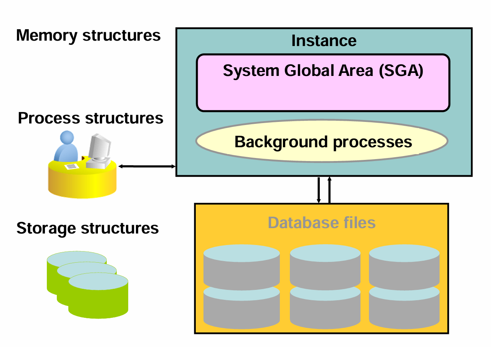


### 启动
- After starting an instance, 
	1. the Oracle software **associates** the *instance with a specific database*. 
		- This is called **mounting the database**. 
	2. The **database** is then ready to be **opened**, which makes *it accessible to **authorized** users*.
	3. **Multiple instances** can execute *concurrently on the same computer*, each accessing *its own physical database*

 - You can look at the Oracle database architecture as **various interrelated structural components**.
	 - **An Oracle database** uses **memory structures** and **processes** to *manage and access the database*. 
	 - **All memory structures** *exist in the main memory of the computers* that constitute the database server. 
	 - **Processes** *are jobs* that *work in the memory* of these computers. 
	 - A **process** is defined as a “thread of control” or a mechanism in an operating system that can *run a series of steps*


# 物理文件
- Control Files(记录了数据库的物理结构信息)
	- 数据库名称
	- 所有**数据文件的位置和大小**
	- 在线重做**日志文件（Online Redo Log）的位置**
	- **表空间**（Tablespace）信息
	- **检查点**（Checkpoint）信息
	- 数据库的**创建时间**
- Data Files(存储实际的用户数据，如表（tables）、索引（indexes）、视图等逻辑对象的物理存储位置)
	- 每个数据文件属于一个特定的表空间（Tablespace）
	- 可以是多个文件组成一个表空间（如 `SYSTEM` 表空间可能有多个数据文件）
	- 一旦创建后，不能直接修改其大小或位置（需通过命令调整）
- Online redo log files(记录所有对数据库所做的**变更操作**（INSERT、UPDATE、DELETE），用于**事务恢复**和**实例恢复**)
	- 当用户执行 DML 操作时，Oracle 先将变更写入 **redo log buffer**，再由 LGWR 进程写入在线重做日志文件。
	- 每次提交（COMMIT）都会触发写入操作。
	- 日志文件是循环使用的（circular），当写满后会切换到下一个日志组。
- Parameter file(定义数据库实例启动时的配置参数)
	- 类型
		- **SPFILE**（Server Parameter File）
			- `spfile.ora`	
			- **二进制格式**，可动态修改（无需重启）
		- **PFILE**（Text Parameter File）
			- `init.ora`	
			- **文本格式**，静态配置
- Backup files(用于在发生硬件故障、人为错误或灾难时进行**数据恢复**)
	- RMAN 备份（推荐方式）
	- 冷备份（关闭数据库后复制）
	- 热备份（在线备份，使用 RMAN）
	- 用于
		- 恢复丢失的数据文件
		- 恢复整个数据库
		- 实现跨平台迁移
- Archive log files(存储已经填满并被覆盖的 **online redo log** 的副本)
	- 支持 **时间点恢复**（Point-in-Time Recovery）
	- 实现 **数据库复制**（如 Data Guard）
	- 是实现 **连续备份** 和 **高可用架构** 的基础
- Password file(允许数据库管理员（DBA）使用 **操作系统认证以外的方式** 登录数据库，特别是远程连接)
	- 使用 `SYSDBA` 或 `SYSOPER` 权限登录
	- 常用于远程管理工具（如 SQL*Plus、Toad）
- Alert and trace log files(提供数据库运行期间的**详细日志信息**，用于监控和故障排查)
	- **告警日志**
		- 记录数据库的重要事件（如启动、关闭、错误、警告）
	- **跟踪文件**
		- 记录特定会话或进程的详细执行信息
		- 用于性能调优、SQL 分析、错误诊断

# Schema
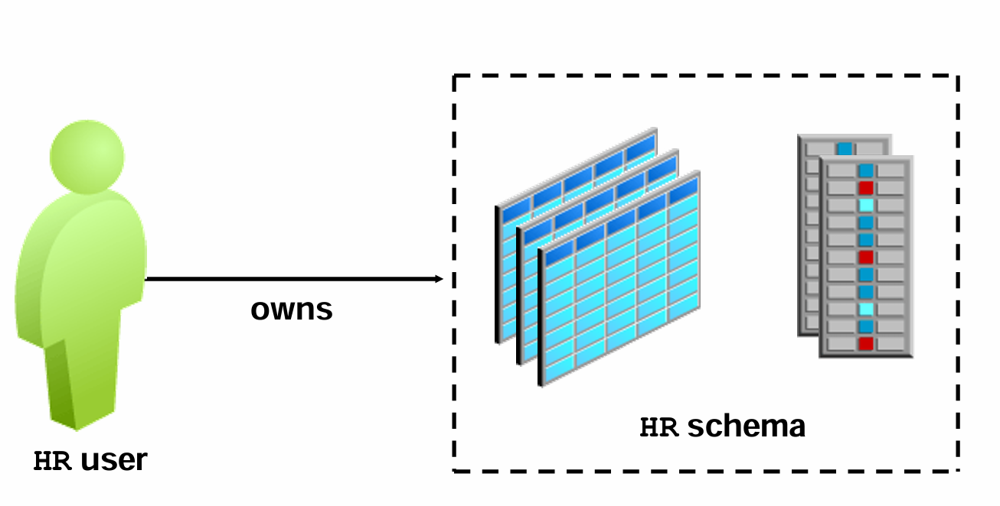
## 什么是Schema对象
- **Database schema** is a *collection of logical data structures* 或者一个schema objects.
	- -逻辑结构(logical data structures)包括：
	    - 表（Tables）
	    - 视图（Views）
	    - 索引（Indexes）
	    - 存储过程（Stored Procedures）
	    - 函数（Functions）
	    - 包（Packages）
	    - 触发器（Triggers）
	    - 序列（Sequences）
	    - 同义词（Synonyms）
	    - 等等
- A **database schema** is **owned** by a *database user* and has *the same name as the username*
	- (每个 **数据库模式** 都归属于一个 **数据库用户（database user）**,并且，这个模式的名称 **默认等于该用户的用户名**)

| 概念 | 说明 |
|------|------|
| Schema | 逻辑容器，用于组织数据库对象 |
| Schema Object | 表、视图、索引等具体的数据结构 |
| Owner | 每个 schema 由一个数据库用户拥有 |
| Name | Schema 名称 = 用户名 |

# 处理SQL
## SQL组件
根据 SQL 语句的类型，会使用不同的组件：

- 查询（Queries）需要额外的处理来将**数据行**返回给用户。
- 数据操作语言（DML）语句需要额外的处理来**记录对数据所做的更改**。
- 提交（Commit）处理**确保事务中修改的数据可以被恢复**。

某些必需的后台进程不直接参与 SQL 语句的处理，但它们用于提高性能并实现数据库的恢复。

---
## 查询过程
查询与其他类型的 SQL 语句不同，因为
- 如果**成功**，它会**返回数据作为结果**。

而其他语句（如 INSERT、UPDATE）只**返回“成功”或“失败”的状态**。

但一个查询可能**返回一行或多行数据**。


There are **three main stages** in the processing of a query:
### 1. Parse解析
- 在解析阶段，**SQL 语句**从用户进程**传递到服务器进程**，并将解析后的 SQL 表示形式**加载到共享 SQL 区域（Shared SQL Area）中**。
	- **用户进程（User Process）**：客户端程序（如应用、`SQL*Plus`）发起请求。
	- **服务器进程（Server Process）**：Oracle 实例中负责处理该请求的后台进程。
	- **共享 SQL 区域（Shared SQL Area）**：位于 **共享池（Shared Pool）** 中，用于存储已解析的 SQL 语句，支持重用，提升性能。

- 在解析过程中，服务器进程执行以下功能：
	1. 在共享池中查找是否存在该 SQL 语句的现有副本（即检查是否可重用）
	2. 通过语法检查验证 SQL 是否正确
	3. 查找数据字典以验证表名、列名等是否有效

| 步骤                  | 作用                                       |
| ------------------- | ---------------------------------------- |
| **软解析（Soft Parse）** | 如果共享池中已有相同 SQL，则跳过语法和语义检查，直接复用执行计划 → 性能高 |
| **硬解析（Hard Parse）** | 如果没有缓存，则需完整解析 → 消耗资源较多                   |
| **语法检查**            | 检查是否符合 SQL 格式，比如是否有拼写错误                  |
| **语义检查**            | 确认表、列是否存在，用户是否有权限访问                      |
### 2. Execute执行和3. Fetch获取
- **执行**和**获取**阶段使用优化器的**最佳策略执行语句**，并*将结果行返回给用户*。
1. **Execute（执行）**
    - **优化器**（Optimizer）选择**最优的执行计划**（如走索引还是全表扫描）
    - 开始**执行该计划**，访问数据块
    - 但此时并不立即返回全部结果
2. **Fetch（获取）**
    - 用户程序（如客户端）逐次调用 `FETCH` 操作，**从数据库中拉取数据行**
    - 可以分批返回（例如每次取 10 行），**直到所有结果返回完毕**

---
## Shared Pool Components(共享池)—与SQL有关
### 程序库缓存（Library Cache）
 会将**最近使用的 SQL** 语句信息**存储在**一个称为“**共享 SQL 区域**”的**内存结构**中。该区域包含：

- SQL 语句的文本（原始代码）
- 解析树（Parse Tree）：**语句的编译版本**（中间表示形式）
- 执行计划（Execution Plan）：**执行**该语句所需的**步骤**

### 优化器（Optimizer）
是 Oracle 服务器中**决定最佳执行计划**的功能模块。

- 如果一个 **SQL 语句被再次执行**，且共享 SQL 区域中已**存在其执行计划**，则服务器进程*无需重新解析该语句*。
- 程序库缓存通过*减少解析时间和内存占用*，**提升了重复使用 SQL 语句的应用性能**。
- 如果某个 SQL 语句*不再被使用*，它**最终会被从程序库缓存中清除**（老化淘汰）。

| 概念 | 说明 |
|------|------|
| 硬解析（Hard Parse） | 首次执行 SQL 或无法复用时，需进行语法检查、语义验证、生成执行计划 → 耗资源 |
| 软解析（Soft Parse） | 在共享池中找到相同 SQL 的执行计划，直接跳过解析阶段 → 快速高效 |
| 绑定变量（Bind Variables） | 使用 `:1`, `:2` 替代硬编码值（如 `'IT'`），使不同参数的相同语句能复用同一执行计划 |
| 老化机制（Aging Out） | 当共享池空间不足时，Oracle 会根据 LRU（最近最少使用）算法淘汰不常用的 SQL |

---
## 数据库缓冲区（Database Buffer Cache）—与被查询的数据有关
- 当处理查询时，**服务器进程**会在数据库缓冲区*缓存中查找所需的数据块*。
- 如果**未找到**，就**从数据文件中读取该块**，并*将其副本放入缓冲区缓存*。
- 后续对同一数据块的请求可能直接命中内存，从而**避免物理磁盘读取**。
- Oracle 使用 **LRU（Least Recently Used，最近最少使用）算法** 来*淘汰长时间未访问的数据*块，为新数据腾出空间。

# 数据库字典和数据库元素
## 数据字典视图
| 视图前缀 | 谁可以查询 | 内容范围 | 是谁的子集 | 备注 |
|--------|-----------|--------|------------|------|
| `DBA_` | DBA用户 | 所有对象 | N/A | 可能包含仅供DBA使用的额外列 |
| `ALL_` | 所有用户 | 用户有权限访问的所有对象 | `DBA_` 视图的子集 | 包含用户自己的对象 |
| `USER_` | 所有用户 | 用户拥有的所有对象 | `ALL_` 视图的子集 | 通常与 `ALL_` 相同，但无 `OWNER` 列；部分视图以 `PUBLIC` 同义词存在 |

- `DBA_`：全局视角，**仅DBA可查**
- `ALL_`：**当前用户可见**的所有对象（含权限）
- `USER_`：只显示**当前用户拥有**的对象

### 使用数据字典
```SQL
a) SELECT table_name, tablespace_name FROM user_tables; 

b) SELECT sequence_name, min_value, max_value, increment_by 3 FROM all_sequences WHERE sequence_owner IN ('MDSYS','XDB'); 

c) SELECT USERNAME, ACCOUNT_STATUS FROM dba_users WHERE ACCOUNT_STATUS = 'OPEN'; 

d) DESCRIBE dba_indexes;
```

- 使用 `user_` 查看**当前用户**的表
- 使用 `all_` 查看**特定用户**（如系统用户）的序列
- 使用 `dba_` 查看**所有用户**账户状态
- `DESCRIBE` 用于**查看视图结构**（类似 `DESC`）

---
## 数据表
### 创建
```SQL
CREATE TABLE dept (
    deptno NUMBER(2),
    dname VARCHAR2(42),
    loc VARCHAR2(39)
);
```

### 查询基本信息
```SQL
SELECT owner, table_name, num_rows 
FROM DBA_TABLES 
WHERE owner='NIKOVITS' AND table_name='DEPT';
```
- 查询所有者，表名称，包括行数量

### 查询列定义
```SQL
SELECT column_id, column_name, data_type, data_length, 
       data_precision, data_scale
FROM DBA_TAB_COLUMNS
WHERE owner='NIKOVITS' AND table_name='DEPT';
```
- 查询列id，列名称，数据类型，以及列长度

---
## 视图（view）
- 视图是**虚拟表**，**基于查询结果**
- `DBA_VIEWS` 可查看视图的原始SQL定义
- 视图**不存储数据**，只**存储逻辑**
- text中存储的就是`AS`连接的查询语句


### 创建
```SQL
CREATE VIEW v1 AS
SELECT deptno, AVG(sal) AvgSal FROM emp GROUP BY deptno;
```

### 查询视图定义信息
```SQL
SELECT view_name, text 
FROM DBA_VIEWS 
WHERE owner='NIKOVITS' AND view_name='V1';
```

---
## 同义词（Synonyms）
- 同义词提供别名，**简化访问路径**
- 公共同义词（`PUBLIC`）可在全库使用
- 同义词**映射到实际对象**（表/视图），可跨模式访问

### 创建
```SQL
CREATE SYNONYM syn1 FOR v1;
```

### 查询同义词信息
```SQL
SELECT * FROM DBA_SYNONYMS 
WHERE owner='NIKOVITS' AND synonym_name='SYN1';
```

### 使用同义词查询
```SQL
SELECT * FROM syn1 WHERE deptno > 10;
```

## 序列
- 自动**生成整数的机制**
- **独立**于任何表或列
- 支持升序/降序、任意步长、循环
- **由名称引用**（如 `seq1`）
- 字段
	- `MIN_VALUE`, `MAX_VALUE`：范围限制
	- `INCREMENT_BY`：步长（+5）
	- `CYCLE_FLAG`：是否循环（Y/N）
	- `LAST_NUMBER`：最近分配的值（50）

### 创建
```SQL
CREATE SEQUENCE seq1
MINVALUE 1 MAXVALUE 100 INCREMENT BY 5
START WITH 50 CYCLE;
```

### 查询序列信息
```SQL
SELECT * FROM DBA_SEQUENCES WHERE sequence_name='SEQ1';
```

### 使用
#### 获取下一个值
```SQL
INSERT INTO dept VALUES(seq1.NEXTVAL, 'IT', 'Budapest');
```
#### 获取当前值
```SQL
INSERT INTO emp(deptno, empno, ename, job, sal)
VALUES(seq1.CURRVAL, 1, 'Tailor', 'SALESMAN', 100);
```

- `NEXTVAL`：**返回下一个值**，并更新序列
- `CURRVAL`：返回上一次 `NEXTVAL` 的值（必须先调用 `NEXTVAL`）
- **注意顺序**：不能直接使用 `CURRVAL` 而未先调用 `NEXTVAL`


## 任意数据库对象
### 查询最近一天创建的对象
```SQL
SELECT owner, object_name, object_id, object_type
FROM DBA_OBJECTS
WHERE owner='NIKOVITS' AND created > sysdate - 1;
```
- `SEQ1` (SEQUENCE)
- `SYN1` (SYNONYM)
- `V1` (VIEW)
- `EMP`, `DEPT` (TABLE

要点：
- `DBA_OBJECTS`：查看数据库中**所有对象**
- `OBJECT_TYPE`：**区分对象类型**（表、视图、序列等）
- `CREATED`：对象创建时间

# 如何存储表
## 数据表
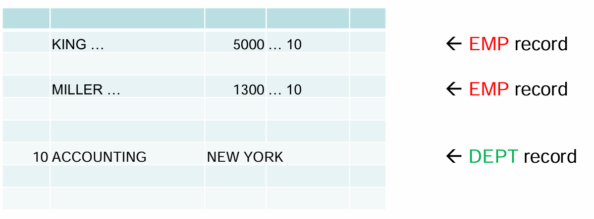
- 尽管 `EMP` 和 `DEPT` 是两个独立的表，但**它们的数据都存储在同一个或多个数据文件中**。
- 数据库并不关心表的边界，而是**按记录形式存储**。
- 查询时，Oracle 会**根据主键或索引定位相关记录并进行连接**。


- 不同表的数据可以**混合存储在同一数据文件中**
- 数据以“记录”为单位存在，**不区分表的逻辑边界**
- **查询**需要**通过关联条件**（如 `deptno`）来**匹配不同表的数据**

## Oracle的不同逻辑存储结构
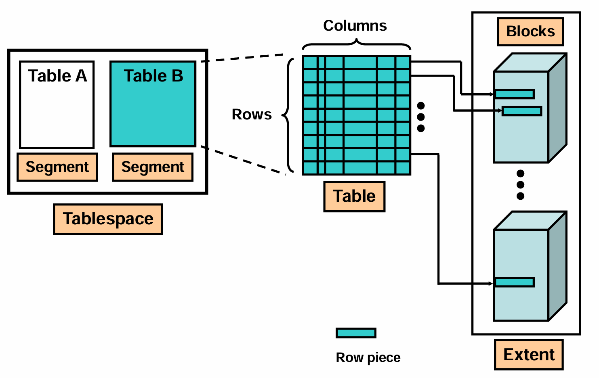

| 内容                             | 解释                                                  |
| ------------------------------ | --------------------------------------------------- |
| 创建表时**生成 Segment**             | 每个表**对应一个 段**（Segment），用于存放**该表的所有数据**              |
| **Tablespace** *包含多个 Segments* | 表空间是逻辑容器，**可容纳多个段**（如表段、索引段等）                       |
| 逻辑上：表 = 多行列值                   | 用户看到的是二维表格，**每一行是一组列值**                             |
| 物理上：Row → Row Piece → Block    | 实际存储时，一行数据可能被**拆分成多个“行片段（row piece）”**，存**放在不同的块中** |

- 当插入的行太大，无法放入单个数据块 → 发生 **行迁移（row migration）**
- 或者更新后数据变大，原空间不够 → 发生 **行链接（row chaining）**

### Segments, Extents, and Blocks（段、区、块）
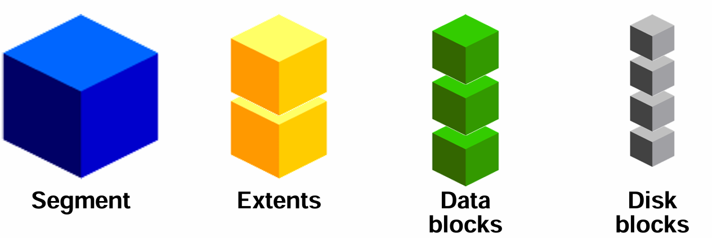

| 名称         | 描述                                           |
| ---------- | -------------------------------------------- |
| Segment    | 一组用于**存储特定对象（如表、索引）的逻辑存储单元**                 |
| Extent     | 一组**连续的数据块**（data blocks），属于某个 segment       |
| Data Block | Oracle 最小的 I/O 单位（通常 8KB），**映射到 操作系统 block** |
| Disk Block | 操作系统层面的磁盘块，是**物理存储的基本单位**                    |

- 每个 **extent 必须位于一个 data file** 内（不能跨文件）
- 所有数据最终都写入 **data blocks**
- **数据块**与**操作系统块**之间有一一**映射关系**（通常是 1:1）

## 数据库逻辑存储结构和实际物理结构
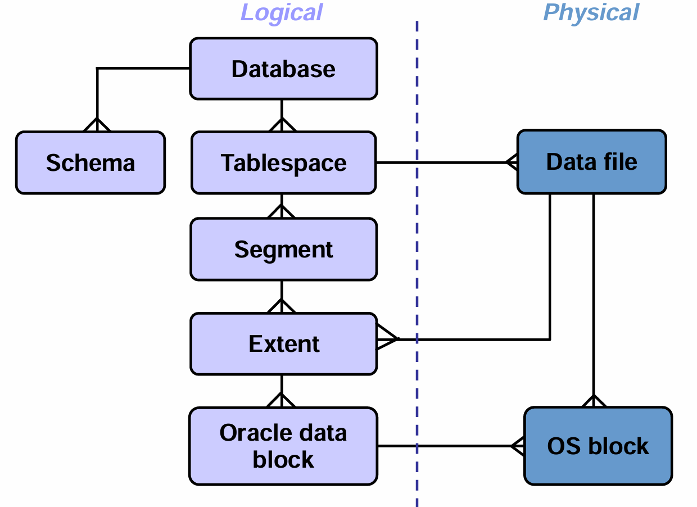
- **Tablespace ↔ Data file**：一个表空间可以对应一个或多个数据文件
- **Extent ↔ Data file**：每个 extent 存在于一个 data file 中
- **Oracle data block ↔ OS block**：数据库块与操作系统块一一对应

## 总结
| 层级 | 名称 | 功能 | 特点 |
|------|------|------|------|
| 最高层 | Database | 整个数据库实例 | 包含所有 schema 和表空间 |
| 第二层 | Schema | 用户模式 | 对象集合（表、视图等） |
| 第三层 | Tablespace | 逻辑存储区域 | 包含多个 segment |
| 第四层 | Segment | 对象的存储实体 | 如表段、索引段 |
| 第五层 | Extent | 连续的数据块集合 | 每个 extent 在一个 data file 中 |
| 第六层 | Data Block | 最小 I/O 单位 | 通常 8KB，存放 row pieces |
| 第七层 | Disk Block | 操作系统级别 | 物理磁盘上的基本单位 |

# 表空间与数据文件
- 每个数据库被**逻辑划分为一个或多个表空间**
- 每个表空间由**一个或多个数据文件（data files）** 组成
- 如果是**临时表空间（TEMPORARY tablespace）**，则使用的是**临时文件（tempfile）** 而非普通数据文件
	- **临时表**空间用于存放排序、哈希连接等操作产生的**中间结果**，*不持久化*
	- 一旦会话结束，临时数据自动清除
- 表空间是**逻辑容器**，而数据文件是**物理载体**

## 定义与作用
- 表空间是数据库的**逻辑存储单位**
- 用于**将相关的逻辑对象（如表、索引）归类在一起**
- **常见做法：**
    - 创建一个表空间**存放应用数据**
    - 另外创建一个**专门存放索引的表空间**（例如 `INDEXES`）

- **优势**：
	- 简化备份与恢复（可单独备份某个表空间）
	- 提高性能（将热点数据放在高速磁盘）
	- 方便权限控制与管理
	- 支持不同存储策略（如压缩、加密）

## 数据文件与表空间的关系
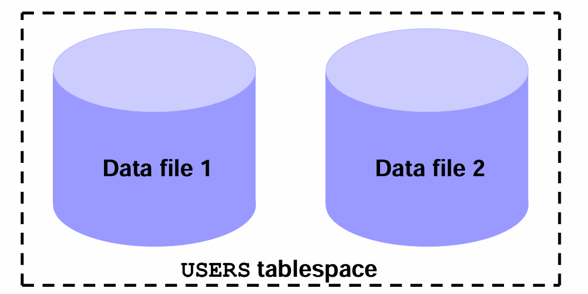
- 一个表空间可以包含 **1 个或多个数据文件**
- 一个数据文件**只能**属于 **一个表空间**
- 数据文件是**实际存储数据的物理文件**（通常为 `.dbf` 文件）

- 数据文件不能跨表空间共享
- 但多个表空间可以共用同一磁盘设备（只是逻辑归属不同）

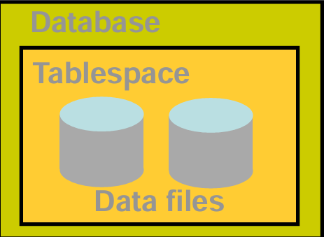

| 类型         | 特性                                                                              |
| ---------- | ------------------------------------------------------------------------------- |
| Tablespace | - 属于且仅属于一个数据库<br><br>- 包含一个或多个数据文件<br><br>- 进一步划分为段（segment）、区（extent）、块（block） |
| Data File  | - 属于且仅属于一个表空间和一个数据库 <br><br>- 是模式对象（schema object）数据的存储仓库                       |

**Oracle 数据库*逻辑*上以表空间存储数据，*物理*上以数据文件保存数据。**

## 特殊表空间SYSTEM and SYSAUX
| 表空间名称      | 作用                                                                                                                 |
| ---------- | ------------------------------------------------------------------------------------------------------------------ |
| **SYSTEM** | - **创建数据库时自动生成**<br><br>- 存放核心功能，如**数据字典表**（data dictionary）<br><br>- **必须始终在线**（online），否则数据库无法启动                 |
| **SYSAUX** | - 辅助表空间，**也随数据库创建**<br><br>- 存放**额外组件**，如 Enterprise Manager Repository、OLAP、XML DB 等 <br><br>- 不是必须的，但大多数企业环境都会启用 |

## Operations with Tablespaces（表空间操作）

| 操作                   | 功能描述                                                                                      |
| -------------------- | ----------------------------------------------------------------------------------------- |
| Add Datafile         | 向现有表空间**添加新数据文件**，*扩展容量*                                                                  |
| Create Like          | **使用**现有表空间作为**模板创建新表空间**（快速复制配置）                                                         |
| Generate DDL         | **自动生成**创建该表空间的 **SQL 语句**，便于文档记录或脚本重用                                                    |
| Make Locally Managed | 将**字典管理**（dictionary-managed）**转换为本地管理**（local-managed），*提升性能*；不可逆。**不能**将本地管理**转换回字典管理** |
| Make Read-only       | 停止所有对当前表空间的写入，**设置表空间只读**，禁止写入，当前事务可完成                                                    |
| Make Writable        | **恢复写入权限**，允许 DML 操作。该操作仅在当前表空间**不可写**时才能使用                                               |

## 查询表空间信息
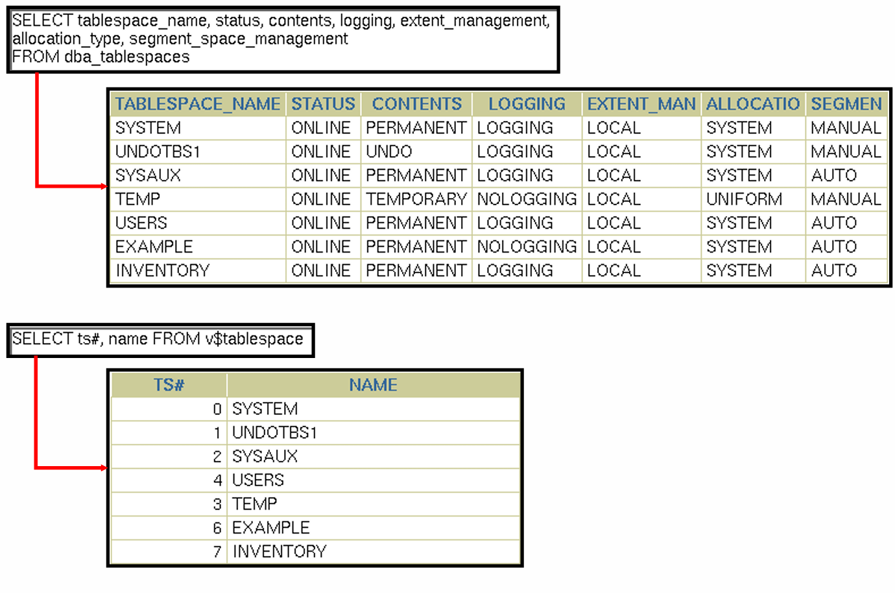

| 字段                         | 含义                           |
| -------------------------- | ---------------------------- |
| `TABLESPACE_NAME`          | 表空间名称                        |
| `STATUS`                   | 状态（ONLINE/READ ONLY/OFFLINE） |
| `CONTENTS`                 | 类型（PERMANENT/UNDO/TEMPORARY） |
| `LOGGING`                  | 是否记录日志（LOGGING/Nologging）    |
| `EXTENT_MAN`               | 区管理方式（LOCAL/DICTIONARY）      |
| `ALLOCATION_TYPE`          | 分配类型（SYSTEM/UNIFORM/AUTO）    |
| `SEGMENT_SPACE_MANAGEMENT` | 段空间管理（AUTO/MANUAL）           |
- 查看表空间状态是否正常
- 判断是否需要扩容


### 方法一：查询 `dba_tablespaces`
```SQL
SELECT 
    tablespace_name,
    status,
    contents,
    logging,
    extent_management,
    allocation_type,
    segment_space_management
FROM dba_tablespaces;
```
### 方法二：查询 `v$tablespace`
```SQL
SELECT ts#, name FROM v$tablespace;
```

## 创建表空间
```SQL
CREATE 空间类型（可选） TABLESPACE 空间名称
DATAFILE '文件名称.f'
SIZE 表空间大小
AUTOEXTEND ON NEXT 20M MAXSIZE 400M;

-- 创建 UNDO 表空间（用于事务回滚）
CREATE UNDO TABLESPACE undots1 
DATAFILE 'undotbs_1a.f' 
SIZE 100M 
AUTOEXTEND ON NEXT 20M MAXSIZE 400M;

-- 创建永久表空间（用于用户数据）
CREATE TABLESPACE tbs_4 
DATAFILE 'file_1.f' 
SIZE 100M 
EXTENT MANAGEMENT LOCAL UNIFORM SIZE 128K;

-- 创建临时表空间（用于排序、连接等临时操作）
CREATE TEMPORARY TABLESPACE temp 
TEMPFILE 'temp01.dbf' 
SIZE 5M 
AUTOEXTEND ON;
```

| 参数                        | 说明                      |
| ------------------------- | ----------------------- |
| `UNDO TABLESPACE`         | 用于存放**撤销数据**（undo data） |
| `TEMPORARY TABLESPACE`    | 使用 tempfile，**不持久化**    |
| `EXTENT MANAGEMENT LOCAL` | **本地管理区**，更高效           |
| `UNIFORM SIZE 128K`       | 每个**区大小**固定为 128KB      |
| `AUTOEXTEND ON`           | **自动增长**，避免空间不足         |

## 总结
| 概念 | 说明 |
|------|------|
| 表空间（Tablespace） | 数据库的逻辑存储单元，用于组织相关对象 |
| 数据文件（Data File） | 物理文件，存储表空间的数据；一个文件只能属于一个表空间 |
| 临时文件（Tempfile） | 专用于临时表空间，存放临时数据，不持久化 |
| SYSTEM 表空间 | 必备表空间，存放数据字典，必须在线 |
| SYSAUX 表空间 | 辅助表空间，存放 Oracle 工具组件 |
| 表空间类型 | PERMANENT（永久）、UNDO（回滚）、TEMPORARY（临时） |
| 管理方式 | 字典管理 vs 本地管理（推荐 local） |
| 扩展方式 | 添加数据文件（Add Datafile）或设置 autoextend |
| 查看信息 | 使用 `dba_tablespaces` 和 `v$tablespace` 视图 |
| 创建语法 | `CREATE [UNDO|TEMPORARY] TABLESPACE ...` |

# Oracle 数据库的存储结构和数据访问机制
## Anatomy of a Database Block（数据库块的结构）
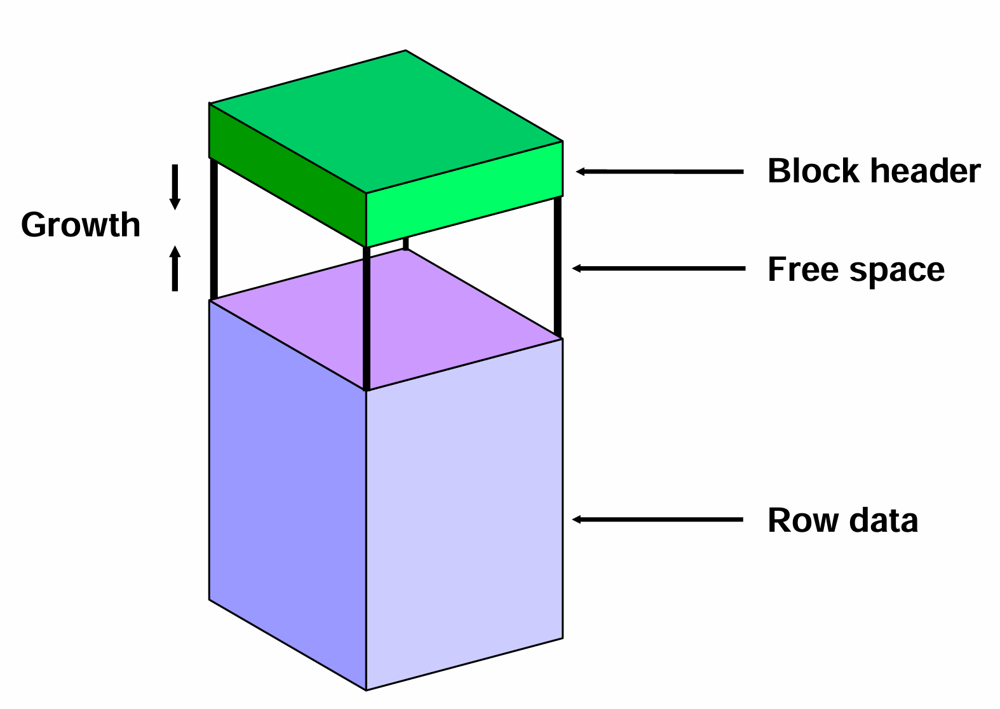

| 部分               | 说明                                                                                           |
| ---------------- | -------------------------------------------------------------------------------------------- |
| Block Header（块头） | 绿色区域，位于顶部，包含**元信息**：<br> - *块类型*（如数据块、索引块）<br> - *所属段*（segment）<br> - *自由空间大小*<br> - *事务信息*等 |
| Free Space（自由空间） | 紫色区域，用于**插入新行**或**更新现有行**<br> - 初始预留空间，可动态调整<br> - 可通过 `PCTFREE` 和 `PCTUSED` 控制              |
| Row Data（行数据）    | 蓝色区域，存放**实际的记录**（rows）<br> - 每行数据按**顺序存储**                                                   |

## Enlarging the Database（扩展数据库）
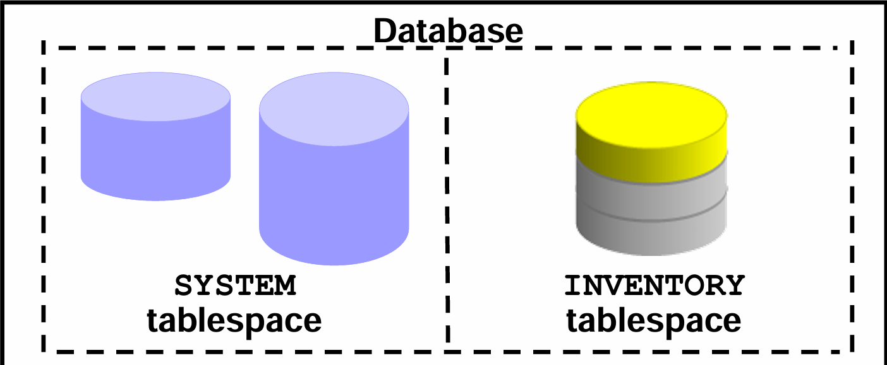

- `SYSTEM` 表空间（蓝色圆柱）→ 核心系统表空间
- `INVENTORY` 表空间（黄色+灰色）→ 用户自定义表空间，可能已添加新数据文件


### 扩展数据库的四种方式：
1. **创建新的表空间（Create a new tablespace）**
2. **向现有表空间添加数据文件（Add a data file）**
3. **增大现有数据文件的大小（Increase size of a data file）**
4. **启用数据文件自动增长（Dynamic growth via AUTOEXTEND）**


### 实践操作
```SQL
-- 添加数据文件
ALTER TABLESPACE inventory ADD DATAFILE '/u01/oracle/data/inventory02.dbf' SIZE 100M;

-- 设置自动扩展
ALTER DATABASE DATAFILE '/u01/oracle/data/inventory02.dbf' AUTOEXTEND ON NEXT 20M MAXSIZE UNLIMITED;
```

## SELECT 语句执行
当用户执行：
```SQL
SELECT datum FROM nikovits.szallit WHERE ckod=2 AND pkod=5;
```
时，数据库系统该如何找到数据？

### 相关对象
1. **Data blocks（数据块）**
2. **Records（记录/行）**
3. **Fields（字段）**

### 步骤
- 先根据索引（如果存在）快速定位到某个数据块
- 再在该块中扫描所有记录（row），匹配条件
- 最后提取指定字段（如 `datum`）返回结果

## 表数据的存储

### 段信息查询
```SQL
SELECT segment_name, segment_type, tablespace_name,
       header_file, header_block, blocks, extents
FROM dba_segments 
WHERE owner='NIKOVITS' AND segment_name='SZALLIT' AND segment_type='TABLE';
```
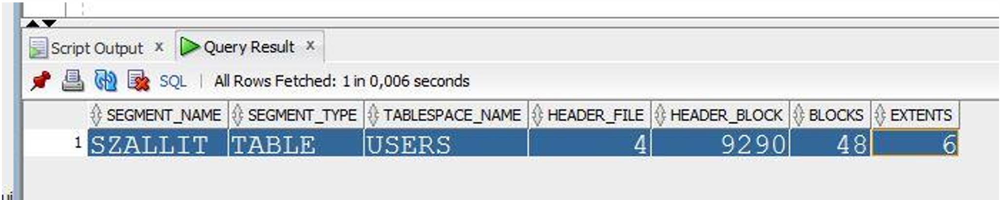

| 字段 | 值 | 含义 |
|------|-----|-------|
| `SEGMENT_NAME` | SZALLIT | 表名 |
| `TABLESPACE_NAME` | USERS | 存放于 USERS 表空间 |
| `HEAD_FILE` | 4 | 头部所在的数据文件 ID |
| `HEAD_BLOCK` | 9290 | 头部所在的块号 |
| `BLOCKS` | 48 | 总共占用 48 个数据块 |
| `EXTENTS` | 6 | 分为 6 个区（extent） |

- **每个表是一个“段（segment）**”
- **段**由*多个“区（extents）”组成*
- **每个区**由*连续的数据块*构成

### 区信息查询
```SQL
SELECT segment_name, segment_type, file_id, block_id, blocks
FROM dba_extents 
WHERE owner='NIKOVITS' AND segment_name='SZALLIT' AND segment_type='TABLE';
```
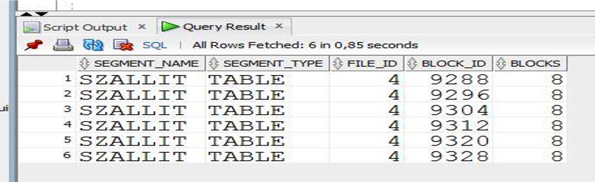

- 表 `SZALLIT` 占用了 6 个区（extents）
- 所有区都在 **file_id = 4** 的数据文件中（对应 `users01.dbf`）
- 每个区包含 8 个连续的数据块
- **区之间不一定连续**，但每个**区内是连续的**

### 数据文件列表
```SQL
SELECT file_id, file_name, blocks
FROM dba_data_files;
```
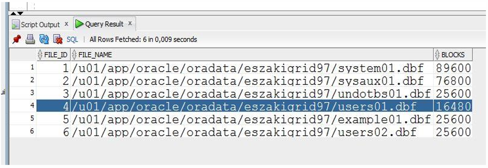
- 该文件总共有 16480 个数据块（约 131MB，假设块大小为 8KB）
- 表 `SZALLIT` 使用了这个文件中的 48($6*8$) 个块（占总数的 0.29%）

### 块和数据文件
#### 获取表空间的块大小
```SQL
SELECT tablespace_name, block_size FROM dba_tablespaces;
```
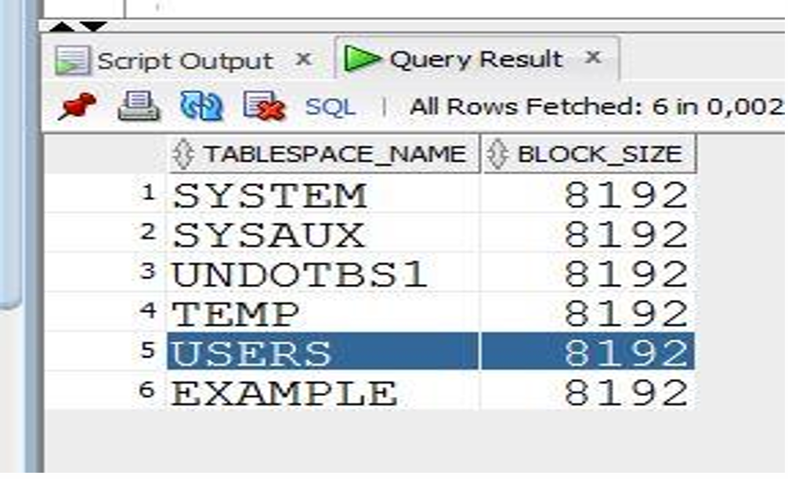
- 所有表空间的块大小均为 **8192 字节 = 8KB**
- 这是 Oracle 默认的块大小（也可配置为 2KB～32KB）
	- 块大小**影响 I/O 效率**和**内存使用**
	- 较**大的块**适合**大对象**（LOB）、批量操作
	- 较**小的块**适合**高并发**、**小事务**

## 定位数据
DBMS 的查找步骤如下：
1. **确定表位置**：
    - 查询 `dba_segments` 获取表 `SZALLIT` 的段信息
    - 得知其在 `USERS` 表空间，`header_file=4`, `header_block=9290`
2. **定位区分布**：
    - 查询 `dba_extents` 获取所有区的起始块号和长度
    - 发现该表分布在 `file_id=4` 的多个区块中
3. **映射到具体文件**：
    - 查询 `dba_data_files` 得知 `file_id=4` 对应 `/u01/app/oracle/oradata/eszakigrid97/users01.dbf`
4. **确认块大小**：
    - 查询 `dba_tablespaces` 得知块大小为 8192 字节
5. **最终访问**：
    - 若有索引，直接定位到目标块
    - 若无索引，则逐块扫描
    - 在块内查找满足条件的行
    - 提取字段值返回

# 记录（Record）
## 可变长度记录（在块中查找记录）
- 当表包含 **可变长度字段**，例如：
```SQL
CREATE TABLE t (field1 INT, field2 VARCHAR2(n));
```
- 或者一个文件中混合存储多个表的数据


### 主要问题
| 问题              | 描述                        |
| --------------- | ------------------------- |
| 删除后产生“洞”（holes） | 删除一条记录后留下的**空隙大小不一**，难以利用 |
| 插入新记录困难         | 需要找一块足够大的连续空间，效率低         |

### Slotted Page Structure（槽位页结构）
1. **Slot Directory（槽目录）**
    - 位于页面底部（或顶部）
    - 每个槽（slot）对应一条记录
    - 存储：
        - 记录的 **起始偏移量（offset）**
        - 记录的 **长度（size）**
2. **Record IDs（记录 ID）**
    - 由 **页号 + 槽号** 构成
    - 例如：`(page=123, slot=5)` 可唯一标识一条记录
3. **自由空间（Free Space）**
    - 未被使用的区域，可用于插入新记录
    - 空间可以碎片化，但通过槽目录统一管理
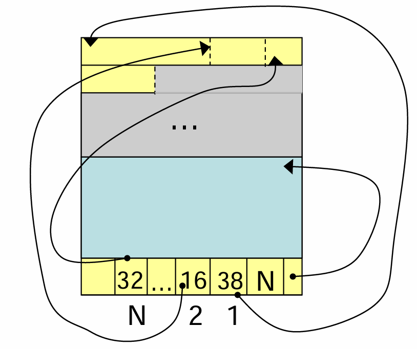

- 每个数字表示该记录的**起始偏移量**
- 例如：`R1` 在偏移量 32 处开始
- `R2` 在偏移量 16 处开始（可能更靠前）
- `N` 表示最后一个槽的位置
- 数据块中的记录可以任意顺序存放，只要槽目录中有正确映射

### 记录组织（在记录中查找字段）
| 类型 | 特点 |
|------|------|
| Fixed-length record formats（固定长度） | 所有字段长度固定 |
| Variable-length record formats（可变长度） | 至少有一个字段是可变长度（如 `VARCHAR`, `TEXT`） |

#### 固定长度记录（Fixed-length）
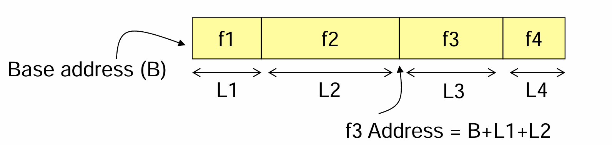
- 字段按顺序**连续存储**
- 每个字段有固定的长度
- 定位公式：
$$f3\:Address = Base\:Address + L1 + L2$$
- `L1`: f1 的长度
- `L2`: f2 的长度
- `Base Address`: 记录起始地址

#### 可变长度记录（Variable-length）
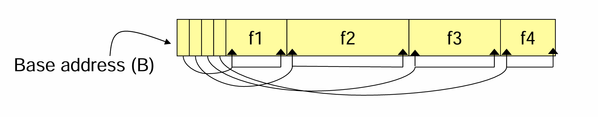
由于字段长度不确定，不能直接按偏移计算。

##### 解决方案：Offset Array（偏移数组）
- 在记录头部维护一个**偏移数组**
- 每个字段对应一个起始偏移和结束偏移
- 若起始偏移 = 结束偏移 → 字段为 NULL

- `O1` 是 f1 的起始偏移
- `O2` 是 f2 的起始偏移（即 f1 结束位置）
- ...
- `O4` 是 f4 的起始偏移
- 每个字段的实际长度 = 下一个偏移 - 当前偏移

- 若某字段的起始偏移 = 结束偏移，则认为该字段为 NULL

### 总结
| 层级 | 问题 | 解决方案 | 核心思想 |
|------|------|----------|----------|
| 块级别（Block） | 如何管理可变长度记录？ | Slotted Page Structure | 使用槽目录记录每条记录的偏移和大小，实现灵活存储 |
| 记录级别（Record） | 如何在记录中定位字段？ | Offset Array | 使用偏移数组记录每个字段的起始位置，支持可变长度和 NULL |

