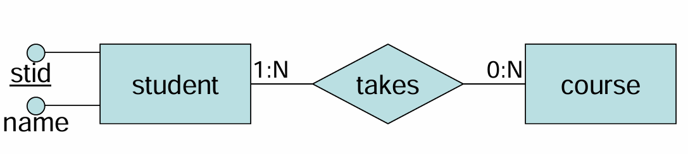

# Physical Storage Organization
# 数据如何存储
## 构建一个数据库
Design conceptual **schema** using a **data model**(UML关系,ER图)


描述各元素之间的关系，构建宏观的对象之间的联系

---

## 逻辑层级
### **建模与结构定义**
- 设计逻辑模式（logical schema）：
    - 关系型（relational）
    - 网状（network）
    - 层次型（hierarchical）
    - 对象关系型（object-relational）
    - XML 模式等
- 使用**数据定义语言（DDL）** 来定义结构（CREATE）
- 关注的是“**数据如何组织**”，不涉及具体实现细节。

### 填充数据
- 使用**数据操纵语言（DML）** 插入(insert)、修改(update)、删除(delete)数据

### Transaction operations
- **事务（Transaction）**：一组执行单一逻辑功能的操作集合
- 示例银行转账：
```SQL
BEGIN TRANSACTION transfer
UPDATE bank-account SET balance = balance - 100 WHERE account=1
UPDATE bank-account SET balance = balance + 100 WHERE account=2
COMMIT TRANSACTION transfer
```
- 若事务失败，可能导致系统处于**不一致状态**（如只扣款未收款）

- 事务具有 **ACID 特性**（虽然未提及，但隐含）：
    - **A**tomicity（原子性）：要么**全部成功**，要么**全部回滚**
    - **C**onsistency（一致性）：保持**数据完整性**
    - **I**solation（隔离性）：**并发控制**
    - **D**urability（持久性）：提交后**永久保存**

### 信息的存储方式
- **Metadata（元数据）**：描述*数据库结构*的信息，如表名、字段、数据类型、约束等
- **Data（数据）**：*实际记录*（records）
- **其他信息**：*事务日志*（transaction logs）、索引（indices）等

- 元数据通常保存在**系统目录（system catalog）** 中。
- 事务日志用于恢复和故障处理；索引提高查询效率。

### 页和记录
- 文件：
    - 物理上划分为 **pages（页）或 blocks（块）**
    - 逻辑上划分为 **records（记录）**
- 每个文件是一系列记录的序列
- 每个记录是一系列字段的序列
- **物理存储单位**：page/block（通常是 2KB～8KB）
- **逻辑存储单位**：record（记录），由字段构成
- 数据库系统通过“**物理块 → 逻辑记录**”的映射来管理数据
- 两种组织方式：
    - **Unspanned organization**：记录完全位于一页内
    - **Spanned organization**：记录跨越多页（尾部溢出到下一页）


### 块和记录
- **Blocking**：指将多个记录存放在一个磁盘块（block）中的技术。
- **Blocking factor (bf)**：每个块中可以容纳的记录数量。
    - 计算公式：`bf = floor(block_size / record_size)`
- 如果记录大小不能整除块大小，则块内可能有**空闲空间（slack space）**。
- 记录可以是：
    - **Unspanned**：一条记录不能跨越两个块
    - **Spanned**：一条记录可以跨多个块（如超长文本）
- 物理块的分配方式包括：
    - **Contiguous**（连续）：文件的所有块在磁盘上相邻
	    - 顺序访问快，但扩展困难
    - **Linked**（链式）：通过指针链接各个块
	    - 动态扩展方便，但随机访问慢
    - **Indexed**（索引）：使用索引表来定位块
	    - 支持快速查找和插入

### 记录删除
- 删除记录后，会留下**空洞（hole）**
- 处理方式取决于记录类型：
#### Fixed-length records（固定长度）
- 删除记录后，可用两种方案管理空闲空间：
	1. **Packed page scheme（压缩页方案）**
		- 删除记录后，将其后面的记录向前移动，填补空隙
		- 页面末尾保留自由空间
		- 更新页头信息（如记录数从 N 变为 N-1）
	2. **Bitmap（位图）**
		- 使用一个位数组标记每个槽位是否有效
		- 1 表示占用，0 表示空闲
		- 删除时只需将对应位设为 0

- 左图：Packed —— 删除 Slot N 后，其他记录前移，总记录数减一
- 右图：Bitmap —— 每个 slot 对应一位，删除后该位置为 0，无需移动数据

### 记录管理（Record）
#### 可变长度记录（在块中查找记录）
- 当表包含 **可变长度字段**，例如：
```SQL
CREATE TABLE t (field1 INT, field2 VARCHAR2(n));
```
- 或者一个文件中混合存储多个表的数据


#### 主要问题
| 问题              | 描述                        |
| --------------- | ------------------------- |
| 删除后产生“洞”（holes） | 删除一条记录后留下的**空隙大小不一**，难以利用 |
| 插入新记录困难         | 需要找一块足够大的连续空间，效率低         |

#### Slotted Page Structure（槽位页结构）
1. **Slot Directory（槽目录）**
    - 位于页面底部（或顶部）
    - 每个槽（slot）对应一条记录
    - 存储：
        - 记录的 **起始偏移量（offset）**
        - 记录的 **长度（size）**
2. **Record IDs（记录 ID）**
    - 由 **页号 + 槽号** 构成
    - 例如：`(page=123, slot=5)` 可唯一标识一条记录
3. **自由空间（Free Space）**
    - 未被使用的区域，可用于插入新记录
    - 空间可以碎片化，但通过槽目录统一管理


- 每个数字表示该记录的**起始偏移量**
- 例如：`R1` 在偏移量 32 处开始
- `R2` 在偏移量 16 处开始（可能更靠前）
- `N` 表示最后一个槽的位置
- 数据块中的记录可以任意顺序存放，只要槽目录中有正确映射

#### 记录组织（在记录中查找字段）
| 类型 | 特点 |
|------|------|
| Fixed-length record formats（固定长度） | 所有字段长度固定 |
| Variable-length record formats（可变长度） | 至少有一个字段是可变长度（如 `VARCHAR`, `TEXT`） |

##### 固定长度记录（Fixed-length）

- 字段按顺序**连续存储**
- 每个字段有固定的长度
- 定位公式：
$$f3\:Address = Base\:Address + L1 + L2$$
- `L1`: f1 的长度
- `L2`: f2 的长度
- `Base Address`: 记录起始地址

##### 可变长度记录（Variable-length）

由于字段长度不确定，不能直接按偏移计算。

###### 解决方案：Offset Array（偏移数组）
- 在记录头部维护一个**偏移数组**
- 每个字段对应一个起始偏移和结束偏移
- 若起始偏移 = 结束偏移 → 字段为 NULL

- `O1` 是 f1 的起始偏移
- `O2` 是 f2 的起始偏移（即 f1 结束位置）
- ...
- `O4` 是 f4 的起始偏移
- 每个字段的实际长度 = 下一个偏移 - 当前偏移

- 若某字段的起始偏移 = 结束偏移，则认为该字段为 NULL

#### 总结
| 层级 | 问题 | 解决方案 | 核心思想 |
|------|------|----------|----------|
| 块级别（Block） | 如何管理可变长度记录？ | Slotted Page Structure | 使用槽目录记录每条记录的偏移和大小，实现灵活存储 |
| 记录级别（Record） | 如何在记录中定位字段？ | Offset Array | 使用偏移数组记录每个字段的起始位置，支持可变长度和 NULL |


---

## 物理层级
### 数据的存储位置
**内存**
- 优点：**速度快**
- 缺点：
    - 太小（容量有限）
    - 成本高
    - 易失性（断电丢失）

- **不能把整个数据库都放在主内存中**。
- 需要结合**外部存储设备**来平衡性能与成本。

### Physical Storage Media（物理存储媒体）

- 存储层次结构从慢速大容量到快速小容量递进：
    1. **三级存储**（Tertiary）：如光盘塔、磁带库，用于归档
    2. **磁盘（Disk）+ 文件系统**：主要存储位置，非易失
    3. **主内存（Main Memory）**：临时高速缓存，易失
    4. **缓存（Cache）**：CPU级高速缓存，速度最快，最小

### 磁盘

特性：
- **Random Access**（随机访问）
	- 可直接定位任意位置的数据（不像顺序存储需要逐个查找）
- **Inexpensive**（成本低）
	- 单位存储成本远低于内存
- **Non-volatile**（非易失性）
	- 断电后数据不丢失

包含多个旋转的盘片（platter）、读写头（read-write head）、臂组件（arm assembly）等。

---
#### 工作原理
- **Platter**：覆盖有磁性材料的圆盘
- **Track**：盘面*逻辑划分*的*同心圆环*
- **Sector**：每个 track 的*硬件分段*（通常512字节或4KB）
- **Block**：*操作系统*对 track 的*进一步划分*（常用于文件系统）
- **Read/Write Head**：读写磁头，*悬浮在盘面上方进行数据读写*

- 每个 **sector** 是*最小的物理存储单元*。
- 多个盘片共享一个主轴（spindle），*同一半径上的所有 track* 构成一个 **cylinder（柱面）**。
- 读写头通过移动臂（arm）定位到指定 track，并等待盘片旋转到目标 sector。

---
#### 磁盘IO
数据库系统的设计核心之一就是**最小化磁盘 I/O 操作次数**。
- **Disk I/O = block I/O**
	- 硬件地址转换为 Cylinder, Surface, Sector
	- 现代磁盘使用逻辑扇区地址（0...n）
- **Access Time**
	- **Seek time**：磁头移动到正确 track 所需时间
	- **Rotation latency time**：等待目标 sector 转动到磁头下方的时间
- **Block Transfer Time**：实际传输数据的时间
- 磁盘 I/O 总耗时 ≈ `Seek Time + Rotation Latency + Transfer Time`

---
####  IO优化
- 数据库性能是 **I/O bound**（受 I/O 限制）
- 提高磁盘访问速度的方法：
    - 调度算法（如电梯算法 Elevator Algorithm）
    - 文件组织方式（堆、索引、哈希）
- 引入磁盘冗余：
    - RAID（Redundant Array of Independent Disks）
- 减少 I/O 数量：
    - 查询优化、建立索引
##### 磁盘阵列

- 使用**多个小型并行磁盘**代替单个大磁盘
    - 可以在一次访问时间内读取 N 个块
    - 支持并发查询
    - 表可以跨多个磁盘分布
- 引入 **RAID**（Redundant Arrays of Independent Disks）
    - 共有 7 级（0–6）
    - 提供三大优势：
        - **可靠性（reliability）**
        - **冗余性（redundancy）**
        - **并行性（parallelism）**

---
#### 如何存储数据
- 存储的内容包括：
    - Metadata：表、属性、类型、约束等
    - Data：记录（records）
    - Transaction logs, indices 等
- 物理上是一系列文件（或表）
    - **Physical partitioning**：划分为 pages 或 data blocks
    - **Logical partitioning**：划分为 records
- 数据库中的所有信息最终都以**文件形式**存储在磁盘上。
- **物理层**：将文件划分为固定大小的**页面（page）或块（block）**
- **逻辑层**：将这些块解释为**记录（record）**

---
#### 访问存储器
- 数据库由一系列文件组成
    - 物理上划分为 pages
    - 典型页面大小：2KB、4KB、8KB
    - 减少 block I/O 就等于减少 page I/O
##### Buffer Manager（缓冲区管理器）

###### 读取
- 负责**管理内存中的页面副本**，避免频繁磁盘访问。
- Buffer：存储页面副本
- Buffer Manager：管理一组 buffer（缓冲池）
	- 是一个**有限的**内存区域，存放最近使用的页面。
    - 若请求页面已在池中 → **命中（hit）**
    - 若不在 → 从磁盘读取并“钉住”（pin）

- **Cache Hit**：无需磁盘 I/O，性能极高。
- **Cache Miss**：必须发起一次磁盘 I/O，代价昂贵。

###### 淘汰
- 如果没有空闲页面帧（empty page frame），缓冲池满时，必须淘汰某个页面：
    - 选择一个“牺牲页”（victim page）
    - 每个页面都有一个 **dirty flag**（是否被修改过）
    - 若选中的页面是 dirty，则先写回磁盘，否则会丢失数据
- 如何选择？→ 替换策略（LRU, MRU）
    - LRU（Least Recently Used）：最近**最少使用**
    - MRU（Most Recently Used）：最近**最常用**（较少用）

### RAID 技术
- 将大量小独立磁盘组成一个高性能逻辑磁盘
- 使用 **data striping（数据条带化）** 来利用并行性提高性能
- 数据条带化透明地将数据分布在多个磁盘上，使其看起来像一个大的快速磁盘

- (a)**Bit-level striping**：按位分片（如 A₀, A₁… 分别放在不同磁盘）
- (b)**Block-level striping**：按块分片（如文件 A 的 Block A₁～A₄ 分别存于不同磁盘）

#### RAID 0

- **Block level striping**按照块分别存储在不同的盘上
- 没有冗余（no redundancy）
	- **任意一块磁盘损坏都会导致整个数据丢失**。
- 最大带宽（maximum bandwidth）
	- 所有数据被均匀分布在磁盘上，读写速度最快。
- 自动负载均衡
- 写入性能最佳
- 但 **无可靠性（no reliability）**

#### RAID Level 1
- **Mirroring（镜像）**
    - 两个相同的副本存储在不同磁盘中
- 支持并行读取（parallel reads）
- 写入为顺序操作（sequential writes）
	- 读性能好（可并行读），但写性能较差（必须写两份）。
- 传输速率接近单磁盘水平
- 是**最昂贵的解决方案**

#### RAID Level 4
- 一个冗余磁盘（redundant disk）
- 块级条带化（block level striping）
- 每个数据块对应一个奇偶校验块（parity block）
- 示例：
    - disk 1: 11110000
    - disk 2: 10101010
    - disk 3: 00111000
    - disk 4: 01100010 ← 奇偶校验（P = D1⊕D2⊕D3）
- 每次更新都必须写入奇偶校验磁盘
- 当某块磁盘失效时，可通过其他磁盘+奇偶校验恢复数据。

#### RAID Level 5
- 包含 RAID 4 的功能
- **奇偶校验盘不再是瓶颈**
    - 奇偶校验块分布在所有磁盘上

#### RAID Level 6
- RAID 6 在 RAID 5 基础上增加了一层奇偶校验（双校验）
- 能容忍**最多两块磁盘同时故障**
- 更高的可靠性，适用于大规模存储系统（如云存储、数据中心）
- 写入开销更大，但读取性能依然良好
- 通常需要至少 4 块磁盘


# 访问文件
## 底层文件操作
| 操作           | 功能说明                                                                   |
| ------------ | ---------------------------------------------------------------------- |
| OPEN         | 打开文件，准备访问，并设置一个“**当前记录指针**”（current record pointer），用于追踪当前**正在处理的记录**。 |
| FIND         | 查找**第一个满足特定条件的记录**，并将其设为当前记录。例如：`FIND WHERE Empno = 100`。              |
| FINDNEXT     | 从当前记录开始，查找**下一个满足条件的记录**。常用于遍历结果集。                                     |
| READ         | 将当前记录**读取到程序变量**中，供应用程序使用。                                             |
| INSERT       | 向文件中**插入一条新记录**，并使其成为当前记录。                                             |
| DELETE       | **删除当前记录**，通常通过**标记**（如设置 `deleted_flag = true`）而非物理移除来实现，以提高效率。       |
| MODIFY       | 修改当前记录中**某些字段的值**。                                                     |
| CLOSE        | 关闭文件，**终止对该文件的访问**。                                                    |
| REORGANIZE   | 对文件记录重新组织。例如：<br>• **物理删除已标记为删除的记录**<br>• 或者**创建新的有序结构**（如重建索引）        |
| READ_ORDERED | 按照某个**字段的顺序读取文件块**（如按员工姓名升序读取所有记录）。                                    |

## 文件组织方式
### 1. Heap files：无序记录文件
### 2. Sorted files：有序记录文件
### 3. Hashed files：基于哈希函数将记录分桶存储文件