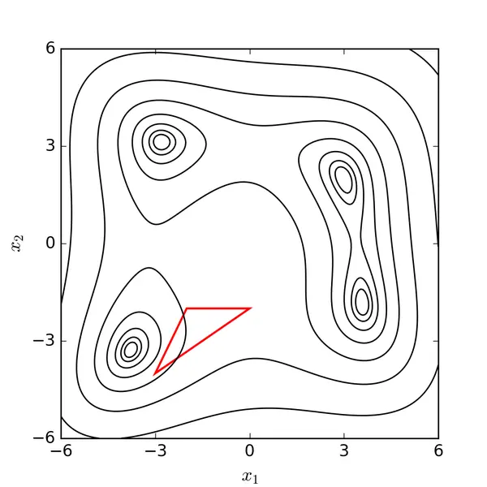

# 纯形
>单纯形（SIMPLEX）是几何学中的概念，是2维中的三角形、3维中的四面体向任意维度的扩展。之所以叫 SIMPLEX，是因为它定义了一定维度空间中最简单的（Simplest）多面体形式。k-SIMPLEX 是一个 **k 维多面体**，是**组成它的 k+1 个顶点构成的凸包**
- 0-SIMPLEX 是一个点；
- 1-SIMPLEX 是一根直线；
- 2-SIMPLEX 是一个三角形；
- 3-SIMPLEX 是一个四面体；

# 下山单纯形法
>算法从一个初始单纯形开始。在每一步迭代中，它根据各个顶点的函数值（好坏程度），通过一系列几何变换将单纯形“滚”向最优解区域。

## 特点
- **无需导数**：它不要求目标函数可导甚至连续，非常适合处理像水文模型这样的“黑箱”问题，你只需要能计算出模型结果与目标值之间的误差即可。
- **几何直觉**：算法基于一个在参数空间中的几何图形——**单纯形**。对于一个 n 维问题，单纯形就是由 n+1 个点构成的图形（例如，2维问题中是三角形，3维问题中是四面体）。

## 核心操作
**TEP-1 初始化**：初始化$n+1$个点  ，作为$n-Simplex$的顶点；

# SCE-UA 优化算法
>核心思想是将“**下山单纯形法**”的局部搜索能力与“生物竞争进化”和“混合洗牌”的全局搜索策略相结合。

## 初始化与分区 (Initialization & Partitioning)：
> 算法在**参数空间内随机生成一个大的初始种群**。然后将这个种群按目标函数值（代表解的优劣）排序，并分割成若干个称为“复合形”的子种群。每个**复合形**负责**在搜索空间的不同区域进行探索**。

## 复合形进化 (Complex Evolution)：
>在每个**复合形内部**，算法使用下山单纯形法进行局部搜索。这个方法能根据当前子种群的几何形状，通过反射、扩张、收缩等操作，找到更优的解，从而指导子种群向其所在区域的最优点移动。

## 混合洗牌 (Shuffling)：
>所有复合形独立进化若干代后，会被重新混合在一起，形成一个完整的种群。这一步是算法的精髓，它打破了子种群之间的边界，促进了不同搜索区域优秀个体之间的信息交流，帮助整个种群跳出局部最优解的陷阱。

## 迭代与收敛 (Iteration & Convergence)：
>算法重复“进化-洗牌”的步骤。随着种群不断更新，所有个体会逐渐收敛到全局最优解附近。

# 时空变源混合产流模型
